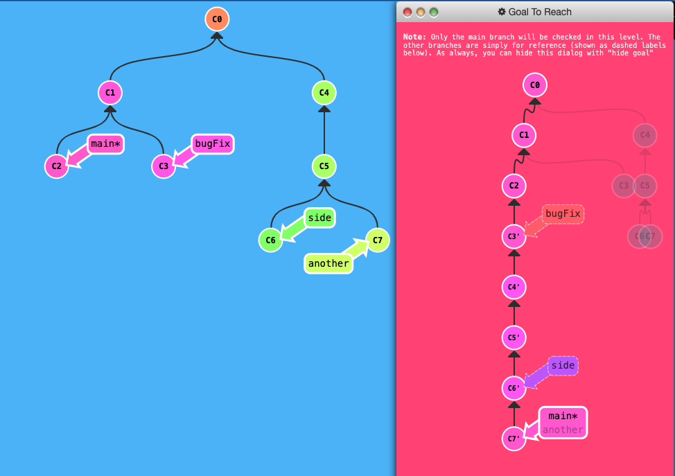

# My Git Learning
## Index
* Cheat Sheets
    * [Github Git](https://github.com/Amalio769/MyLearning/blob/master/docs/git/Pictures/github-git-cheat-sheet.pdf)
    * [Education](https://github.com/Amalio769/MyLearning/blob/master/docs/git/Pictures/git-cheat-sheet-education.pdf)
    * [Git Cheat Sheet – 50 Git Commands You Should Know](https://www.freecodecamp.org/news/git-cheat-sheet/)
* [Fundamentals](#fundamentals)
    * [Merge](#merge)
* [Advanced](#advanced)
    * [Merging vs. rebasing](#merging-vs-rebasing)
* [Tips and Tricks](#tips-and-tricks)
    * [Upload a Repository from laptop to Github](#upload-a-repository-from-laptop-to-github)
    * [Create a Tag for the repo](#create-a-tag-for-the-repo)

## Fundamentals

### Merge
How to achive the goal


The solution:
```bash
git rebase main bugFix
git rebase bugFix side
git rebase side another
git rebase another main
```
## Advanced


### Merging vs. rebasing
> See this [link](https://www.atlassian.com/git/tutorials/merging-vs-rebasing?utm_source=gdn&utm_medium=paid-display&campaign=21252494340&adgroup=&device=c&devicemodel=&placement=&aceid=&creative=&adtype=&gclid=EAIaIQobChMI4srn8br7hgMVbK1oCR1Z1w71EAAYASAAEgI0V_D_BwE&country=&network=x&targetid=&gad_source=1)

## Tips and Tricks
### Upload a repository from laptop to github
First you create the repo in github --> <repo-name>
```bash
cd <dir-repo>
git init
git remote add origin https://github.com/<github-user-name>/<repo-name>.git
git add .
git commit -m "Initial commit"
git push --set-upstream origin master
```
### Create a `tag` for the repo
```bash
git tag "v1.0.0"
git push --tags
```