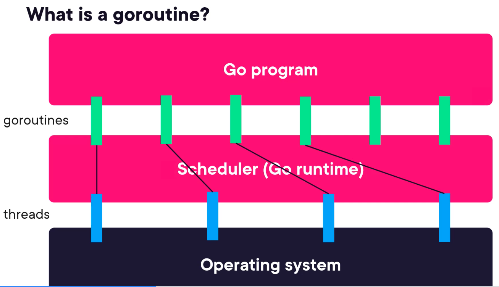
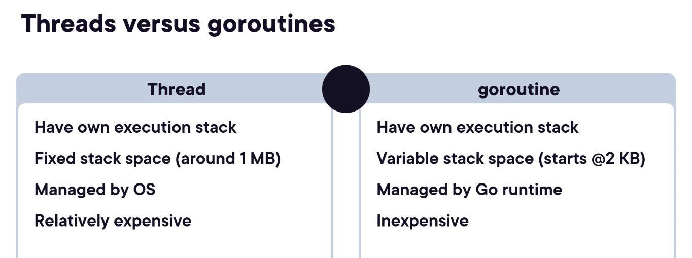
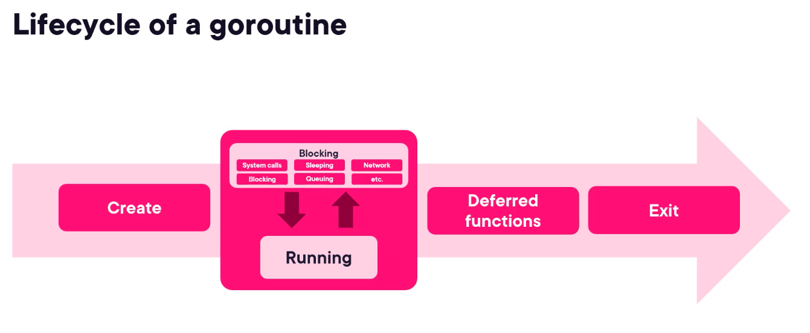
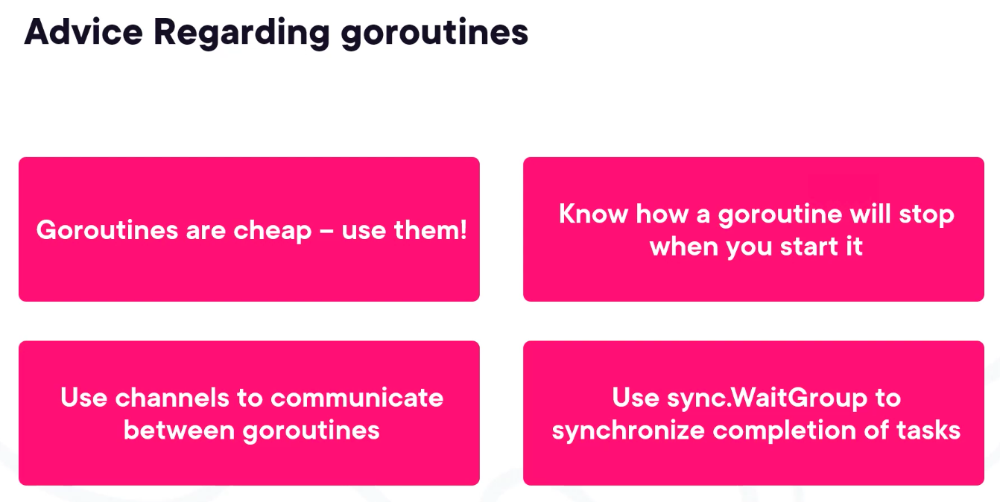
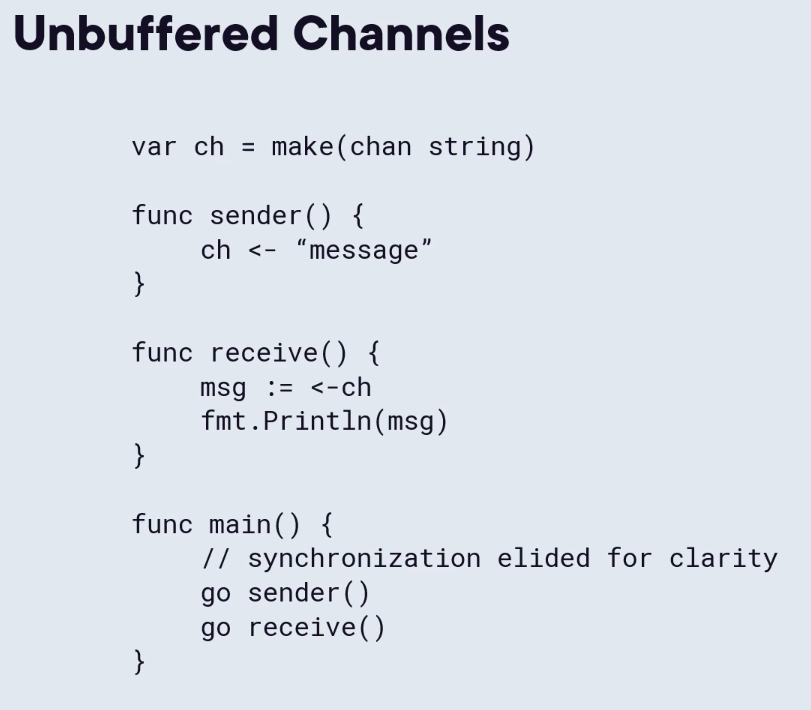
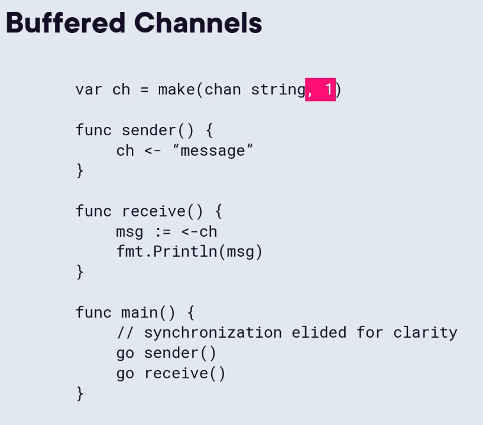
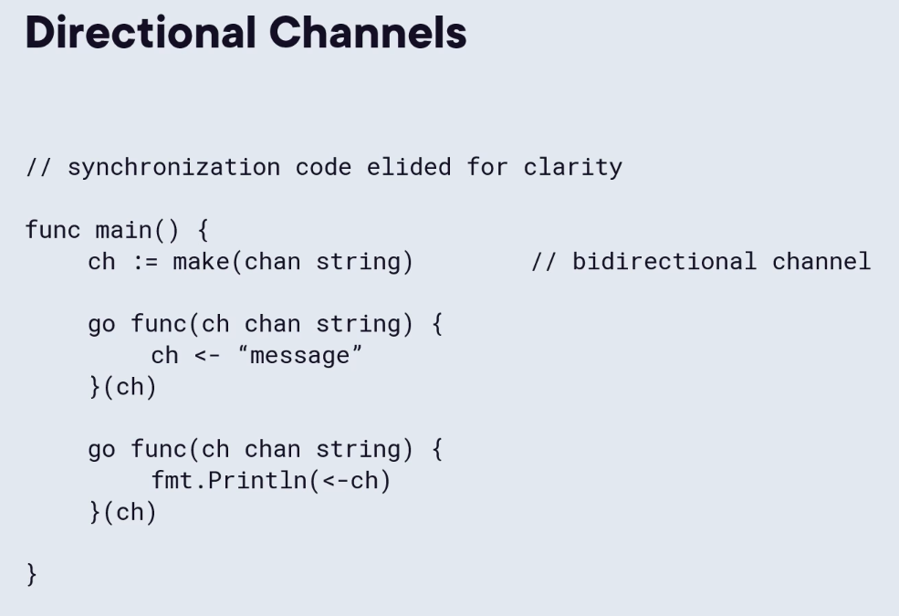
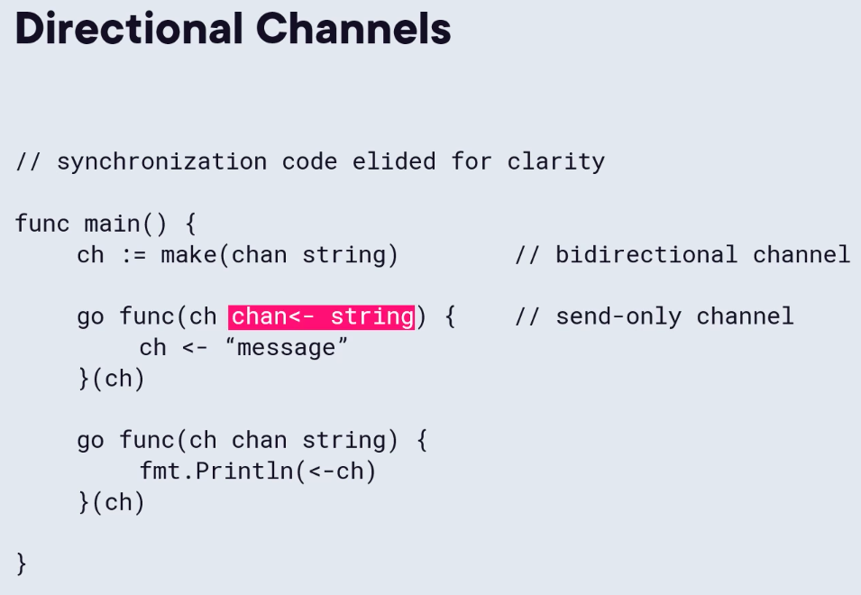
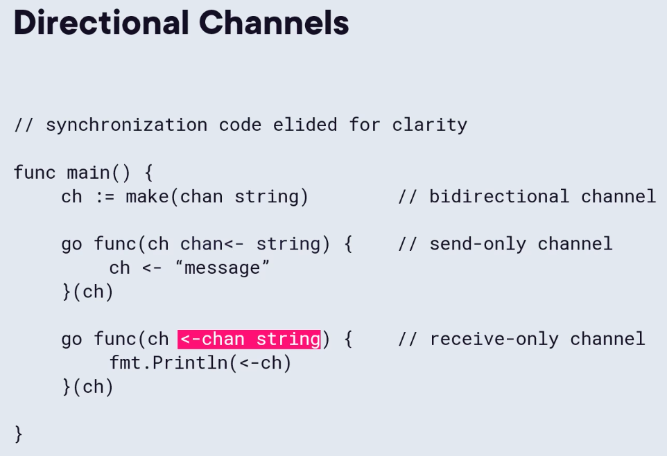

# Concurrent Programming in Go
## Goroutines

We're going to have our Go program. This is going to be the code that we write, and that's going to interact with the Go runtime. And the specific part of the runtime that I want to focus on is something called the scheduler, and we'll see what the scheduler does as this slide evolves. And then finally, at the bottom of our application execution is the operating system that the application is going to interact with. Now goroutine sits right here. Goroutines interact between our Go program and the scheduler. Now there are some goroutines that are actually created internally by the runtime, but we're not going to focus on those right now. Let's just imagine that goroutines are exclusively those concurrent tasks that we initiate. And then between the scheduler and the operating system are constructs called threads.

The scheduler can decide based on what those goroutines are doing, it can optimize the amount of time that the goroutines are spending on threads to improve the performance of our program as much as possible. Now, that's one benefit of goroutines. It allows our Go program to have more control over what is actually working concurrently or not.

Now what the scheduler does is it takes these goroutines, also known as virtual threads, these are maintained purely within our Go program, as you see on the slide. But a goroutine is limited. Since it's not directly interacting with the operating system, it can't do anything on its own. That's where the scheduler comes in. The scheduler will map goroutines onto operating system threads. Remember, those threads are where the operating system actually executes those concurrent tasks. So in order for a goroutine to actually do anything, it has to be scheduled onto a thread.

So what is the lifecycle of a goroutine? Well, at a very high level, if we were to just guess, we could probably come up with three stages of a goroutine's lifecycle. We would have the creation, so you have to kick a goroutine off. It would execute. It would do some work with the function that we invoked with the goroutine. And then eventually, most goroutines would exit.

So this applies and this makes sense, but I want to dig in a little bit further. Now when we talk about execution, remember we just got done talking about that scheduler and how one of the scheduler's responsibilities is to take those goroutines and schedule them onto operating system threads so that they can actually be executed. Well, that means that during the execution phase of a goroutine, they're not always executing. Matter of fact, goroutines are constantly moving back and forth between a blocking state and a running state. So if a goroutine's not scheduled on a thread, then it's blocking. It's not doing anything. If it is on a thread, then often it is running. Now this makes sense. So is that all that a goroutine does? Well, I do want to add one more thing in here. It's not a specific topic of this course, but it is something very important that goroutines do, and that is the goroutine does have the responsibility of executing deferred functions as well. So if the goroutine has deferred functions that it initiates, that goroutine is going to be the execution context for those deferred functions as well. Not too much to talk about there, but for completeness, I did want to talk about that as well. And then the final thing I want to talk about is I want to come back to this blocking element right here inside of our execution block. So what can cause a goroutine to block? Well obviously, it can block if it's not on a thread, but why would the scheduler do that? Well, there's actually quite a few reasons why the scheduler might not select a goroutine to be allocated to a thread. The goroutine might be waiting on a system call. So for example, if the goroutine has asked the operating system to create a file, well that's an operating system operation, and so that's going to be a system call that the Go runtime has to make down to the operating system. If the goroutine is waiting for that response from the operating system, the scheduler is smart enough to realize it can't do anything until the operating system gets back to it. And so that would be one reason why the goroutine would not be scheduled on a thread. The goroutine could simply be sleeping. So we have a sleep function in the time package that's going to tell a goroutine that we don't want it to execute for a certain period of time. So, that would be another reason why the scheduler would not allocate a goroutine to a thread. It could be waiting on network activity. If you make a network request, then that's going to cause the goroutine to have to wait for that network request to respond. And once again, there's no value having a goroutine sitting on a thread waiting for a network response. Instead, the scheduler will pull that goroutine off a thread, it'll wait for the response to come back, and then it will relaunch that goroutine onto a thread when the response is available. It could simply be blocking. This is often associated with channel operations. A normal channel will block on a sending operation until a receiver is available, and it will block on a receiving operation until a sender is available. If a goroutine is in that state where it's executing an expression that's waiting for a channel operation and that channel operation cannot be acted upon, then the goroutine goes into what's called a blocked state. It could also be queuing. What does that mean? Well, it does take a certain amount of time for the scheduler to actually get a goroutine onto an operating system thread. So that amount of time that's taken is very, very small, but it is there, is what's called a queuing step. And once again, that's going to be a time when the goroutine wants to be working, the scheduler wants it to be working, but it's just not there yet because the goroutine isn't quite on the thread yet. And there can be other things. For example, if you've got 100 goroutines in your application and only 15 threads in your operating system, well you can only do up to 15 things at a time. So there's lots of reasons why goroutines might be blocked and might not be operating, but these are some of the most common ones. As you get into Go's profiling tools and you start profiling the performance of goroutines, you're going to see these terms come back because these are the things that the profiling tools will analyze and help you understand why your goroutines aren't executing 100% of the time.

So what can I tell you about using goroutines? Well, the first and most important piece of advice that I can give you is goroutines are cheap, use them. Unlike concurrency models that use operating system threads directly, goroutines are designed to be extremely lightweight. Their creation does not require any interaction with the operating system, and the memory overhead that a goroutine requires starts at a very, very small 2 KB. So they're very inexpensive. They're designed to be that way. So don't be afraid to use goroutines in your Go programs. They're built to be used in a massive quantity if your application requires it. Know how a goroutine will stop when you start it. We're actually going to revisit this throughout this course a couple of times. But one of the most important things with a goroutine is they can be made to block infinitely. I occasionally get the question about, hey, Go is the garbage collected language. Is there any way that the garbage collection has been known to screw up? And the general answer is no. There might be some very rare edge cases that have come up, but generally Go's garbage collector has been recognized to be extremely robust. However, if you want to create a resource leak in Go, you can do it. You create a goroutine that never terminates. If that goroutine never terminates, its local variables are never released, and the number of resources that can be tied up in those goroutines can be pretty large. So when we create goroutines in our Go programs, we want to think about the entire lifecycle. We want to make sure that the goroutines have an exit strategy unless the goroutine is supposed to last forever. Sometimes, goroutines last the entire runtime of our program, and that's fine, as long as you thought about it and know what that goroutine is supposed to do. Use channels to communicate between goroutines. Channels exist specifically for this use case. That's why they're built into the language, and it is the other part. Goroutines are one part of that communicating sequential processes model. Well, channels are the other. Channels provide a very safe way to send messages between goroutines without having to worry about data races or anything like that. And since, by default, channels use copy semantics, then the message on the sending side is not going to interfere with the message on the receiving side because the receiver is going to receive a copy of that data structure. Now when we're working with pointers, things become a little bit more complicated because we're in a data sharing mode then. But in general, as long as we stick to copy semantics with our types, then channels provide a very safe communication mechanism between goroutines. And finally, use those WaitGroups to synchronize completion of tasks. Probably the most useful component of the sync package for me personally is the WaitGroup. The WaitGroup allows us to have a single goroutine. So, for example, our main function will wait on a tree of concurrent tasks. And we can keep adding on tasks to that WaitGroup, and the main function or whatever the supervisor function is is going to wait for all of those to be done by simply using that Wait method on the WaitGroup. So don't be afraid of them. They're very lightweight. They're optimized for concurrency, so you're not going to run into data races, so go ahead and use those.

## Channels
### Buffered and Unbuffered Channels

To remind you what an unbuffered channel is, I've got this snippet of a small Go program. As you can see, we start out by creating a channel, and then we have two functions, one is called sender that's simply going to send a message into a channel, and then we've got receive that's going to receive that message and print it out. And then finally, we have the main function that's going to initiate those two goroutines, one for the sender function and one for the receive function. And as I commented here, the synchronization logic has been alighted just to keep things clear. Now this is an example of what's called an unbuffered channel. So when we run this, we see that the execution pointer is going to initiate the sender function. This is going to be initiated from that main function below. And then we're going to hit this statement here where we're trying to send this string into the channel. Now at this point, there are no receivers for this message. And so the Go scheduler is actually going to block this function right here. So this goroutine is now going to enter the status blocked. Then the scheduler is going to activate the receive function, and that's going to try and receive a message from the channel. Now once again, the Go scheduler is going to block this because it's going to look to see if the senders and the receivers are matched. As soon as it recognizes that they're matched, it's going to go ahead and allow both goroutines to continue to execute. So the sender function is going to exit its function body, and the receive function is going to move on to that print statement. This is the behavior of an unbuffered channel. The senders and the receivers must be synchronized, and it's one of the responsibilities of the scheduler to make sure that that synchronization happens. 

With a buffered channel, we make a slight change to the construction of the channel itself. So notice up here on the first line, I've added the second parameter, and that's a positive integer, in this case, the number 1. What this does is this tells the make function to construct a channel that has an internal buffer or an internal storage capacity. In this case, that capacity is 1, and it allows the channel to store a single message within itself. Now if we had a buffer of size 10, then we could store 10 messages within the buffer. So when this program runs, once again we start the sender function. The channel operation happens right here. We try and send this string into the channel. And in this case, we do have a receiver available because the channel itself can receive that message into its buffer. And so, this goroutine continues to execute and terminates. Then sometime later, the scheduler is going to activate the receive function, and it's going to try and receive that message, and it's immediately able to do that because the message is sitting in the buffer, and so the message can be received out of it. This decouples the sending side of our channel from the receiving side of our channel, and that's one of the primary use cases for buffered channels.

### Directional Channels

By default, when we construct a channel in Go, it can both receive messages and send messages. And that makes sense because that's kind of the point of the channels, to be able to send and receive messages. This is what's called a bi‑directional channel. And while they're very useful and that's what you're going to be working with all the time when you construct a channel, they don't always provide the level of clarity that we want. 

So if you take, for example, the code that we have here, the first goroutine is trying to send a string into the channel, and the second goroutine is trying to receive a message from the channel. Now very often, when we're creating Go programs, channels have only one purpose within a goroutine. We're either trying to send messages into that channel or receive messages from that channel. However, since we're passing in a bi‑directional channel, we can actually do the other operation. So for example, we could try and receive a message in the first goroutine or send a message in the second one. This makes our programs slightly harder to read and to understand and introduces the possibility of bugs because the channels could be used incorrectly. 

To correct this, what we can do, if you'll notice, I'm passing the channels into the goroutines. The reason I did that was it allows us to do something very special and that is creating a directional channel. 

So in this first goroutine, I'm going to add that left‑facing arrow again. Remember, we always use the left‑facing arrow when we're talking about channel operations with Go. And I'm going to add that after the chan keyword. So we see that the arrow is pointing from the type, string in this case, toward the channel. This is going to be a send‑only channel. So now, in this first goroutine, if I tried to receive a message from the channel, that's going to be a compile time error. So not only do we get better documentation about the intent of the channel, but the compiler is going to help us enforce that. 

Similarly, in the second goroutine, we can add that left‑facing arrow again, but add it before the chan keyword, and that turns this into a receive‑only channel. So now, we know that this channel is only going to be used to receive messages within this goroutine.
> It's a very important best practice to use to make your code more clear and allow the compiler to help detect subtle errors that might creep into your Go program.

