# Gin 1 Fundamentals
## Index
* [Introduction](#introduction)
* [Routing Request](#routing-requests)
    * [Static Routes](#static-routes)
    * [Serving Files](#serving-files)
    * [Routing with HTTP Methods](#routing-with-http-methods)
    * [Parametrized Routing](#parametrized-routing)
    * [Route Groups](#route-groups)
* [Working with Requests](#working-with-requests)
    * [Request Objects](#request-objects)
    * [Retrieving Route Parameters](#retrieving-route-parameters)
    * [Retrieving Query Parameters](#retrieving-query-parameters)
    * [Retrieving Post Form Data](#retrieving-post-form-data)
    * [Data Binding](#data-binding)
    * [Data Validation](#data-validation)
* [Generating Responses](#generating-responses)
    * [Sending Files](#sending-files)
    * [Sending Arbitrary Data](#sending-arbitrary-data)
    * [Streaming Response Data](#streaming-response-data)
    * [Rendering HTML](#rendering-html)
    * [Sending Other structured Data](#sending-other-structured-data)
* [Using Middleware](#using-middleware)
    * [What is Middleware?](#what-is-middleware)
* [](#testing-and-error-handling)
    * [Testing Handlers](#testing-handlers)
        * [Testing Handlers without HTTP](#testing-handlers-without-http)
        * [Testing Handlers whit HTTP](#testing-handlers-with-http)
    * [Handling Errors](#handling-errors)
    * [Managing Panics](#managing-panics)
## Introduction
Gin is a fast, lightweight web application framework that can greatly simplify the creation of web‑based programs using Go.

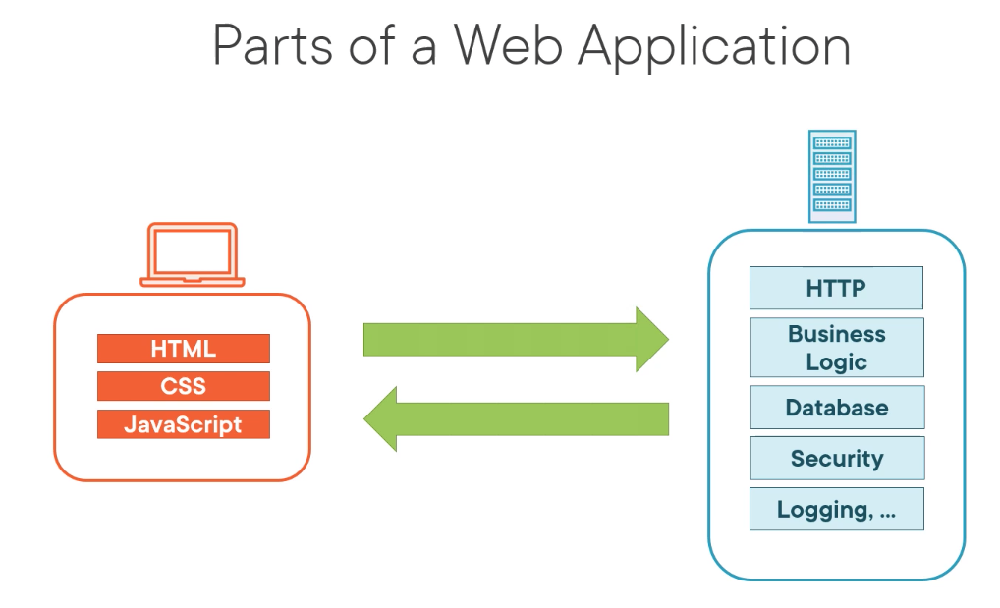

At the most basic level, a web application is defined as having a client and a server. The client will send a request to the server and the server will send some sort of response back. On the client side of a full web application, we often have assets, such as HTML that determines the structure of a web page, CSS for styling, and JavaScript for behaviors that actually brings the life to a website. On the server side, we've got other concerns. The server is responsible for HTTP, so it's responsible for taking in those requests, performing an operation called routing, sending those requests to the proper part of our application for handling, and then sending the response back to the requester. Additionally, the server houses our business logic, it takes care of interactions with the database so that we can have long‑term storage of our data, and then it also has concerns such as security, making sure that any requests coming into the site are valid and any responses that go out are not corrupted. And the server has other responsibilities, such as logging and other concerns. The primary focus of Gin is right here. It sits on the server side and it's primarily concerned with the HTTP side. So, handling those requests, receiving those, routing them to the proper part of our application, and then sending the responses back. It does interact slightly with these other components, but its primary responsibility is right here.

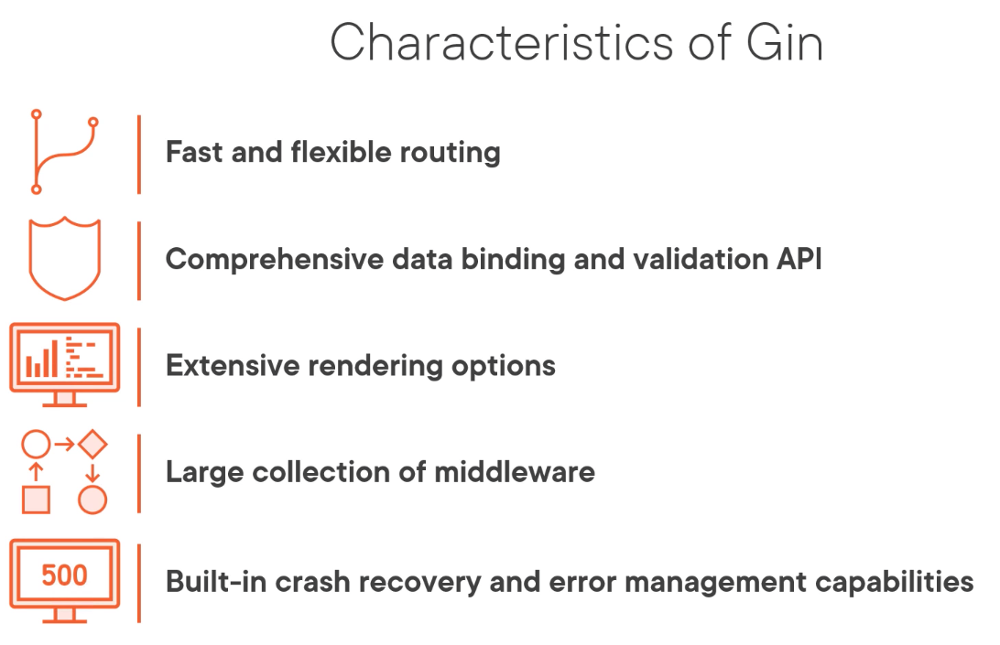

So what are some characteristics of Gin? Well, first of all, it's got very fast and flexible routing. Gin uses one of the fastest routers in the entire Go ecosystem, so you can very quickly set up routing and be sure that the routing resolution is not going to slow your application down. It has a comprehensive data binding and validation API, so you're not going to have to worry about taking raw messages from JSON representations or multiple other representations, including things like XML, you're not going to have to worry about serializing and deserializing those into your Go objects. Additionally, if you want to do validation on the incoming data, making sure that it meets your business rules, you're going to have a rich set of tools available to you with Gin's validation API. It has an extensive set of rendering options. Now a lot of times when we talk about rendering, we're thinking about HTML, but Gin takes that concept farther, so we can render HTML, we can render JSON, XML, protocol buffers, a lot of different formats are available right out of the box. It also has a large collection of middleware. Middleware is a piece of software that's going to sit in the middle of the request/response pipeline. It's not actually responsible for the primary handling of the request, but it has some other responsibilities, such as logging the request. Well, we're going to see when we get to the end of this course the types of middleware that Gin has built in and how easy it is to build our own. And finally, Gin focuses on built‑in crash recovery and error management. So one of the things that sets Go applications apart from a lot of other languages is they tend to be remarkably stable in production, and Gin reinforces that capability by building in APIs and functionality that are going to ensure that when something does go wrong in our application, we're able to track that problem, understand what happened, and recover from it safely.

Hello World! example:
```go
package main

import (
    "log"
    "net/http"

    "github.com/gin-gonic/gin"
)

func main() {
    router := gin.Default()

    router.GET("/", func(c *gin.Context){
        c.String(http.StatusOK, "Hello, world!")
    })

    log.Fatal(router.Run(":3000"))
}
```
## Routing Requests

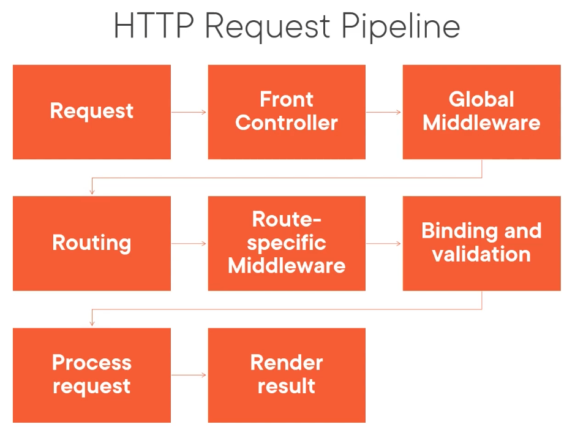

Well, the request pipeline starts with the request. This is where a client sends a request to a server to perform some action. That request in Gin is received by something called the front controller. The front controller is a single piece of code that receives every HTTP request into our application. It then has the option of passing that request or altering that request using something called global middleware. We mentioned middleware in the last module where we said it's a piece of functionality that isn't directly responsible for managing the request, but it's something regarding the request, like logging or security, things like that. Well, global middleware is that functionality applied to every request. From the global middleware, we're actually going to go into our routing system. This is where our request is going to be routed through the handlers that we have registered in our application and taken to the code that's actually going to process the request. Before it gets there, we might introduce route‑specific middleware. This is the same as global middleware, but it's not going to affect every request; it's only going to reflect requests that match certain routes. From there, we're going to go into binding and validation. This is where Gin is going to take the data from the incoming request, and it's going to turn it into Go objects for us, and it's also going to apply any validation rules that we have established. Finally, we're ready to process the request. This is where our request handlers are going to live. This is where we take the data that's coming from the request, apply our business logic, interact with the database, and prepare to generate a response. And then finally, that leads to rendering a result, where we've done the data processing, we have the answer, now it's time to send the result of that request back to the requester so they know if the server was able to accomplish the task or not, and if it was, what was the result.
### Static Routes
Static routes are probably the easiest thing for us to work with in our Gin applications. We're going to start by creating a router like you see here, and this is pretty much going to be the starting point for any type of routing. We're going to use this `Default` function that we've talked about before. The `Default` function is the primary way that you're going to create a router. There's other ways that we'll talk about as the course progresses, but for now we're going to focus on this method for creating a router. Then we're going to invoke one of the methods on the router. In this case, we're calling the `GET` method, and we're going to pass in a static URL path, and that's this element that you see highlighted here in orange. The /hello/world will exactly match that URL path every single time. So every time a request comes in on that and only that route, it's going to invoke the function that we pass as the second parameter to the `GET` method. And in this case, we're just going to pass back the string "Hello, world!" And that's pretty much all you need to know with static routes. Every time a request comes in on exactly that URL path, that's going to invoke that static route.

```go
router := gin.Default()         // create a router

router.GET("/hello/world", func(c *gin.Context) {
    c.String("Hello, world!")
})
```

### Serving Files
Gin gives us two ways to serve static files in our applications. 

* The first way starts by creating a router; that's how we're almost always going to start working with routes in Gin. And then we're going to call the `StaticFile` method on that router. That `StaticFile` method takes two parameters. It takes the URL path, so we're going to register a static path, and then as the second parameter instead of a handler function, we're just going to pass a string, and that's going to be the path to the file that we want to serve up relative to the application's current working directory. An example of that would be something like this, where we might register the /static path and then route that to the ./public directory on our server. Then anytime a request comes in starting with /static, Gin is going to look in that public directory for that resource. And we can go through nested path. So you could do /static/foo/bar.img, and that's going to go to /public/foo/bar.img.
```go
router := gin.Default()             // create a router

router.StaticFile({URL path}, {path to file})
```
```go
router := gin.Default()         // create a router
router.StaticFile("/favicon.ico", "./public/img/favicon.ico")
```
* The next strategy that Gin offers us is a little bit more flexible, and that's creating something called a `file serve`. A file server serves up not just a single file, but an entire collection of files.So we're going to start once again by creating that router, and then we've got two strategies that we can employ here.
    * The first is by calling the Static method on the router. The Static method takes two parameters. The first parameter is going to be the URL path that's going to serve as the root of the collection of the file server. And then the second parameter is going to be the root of where the files are located on our server itself. So this is going to be a path on our file system. An example of that would be something like this, where we might register the /static path and then route that to the ./public directory on our server. Then anytime a request comes in starting with /static, Gin is going to look in that public directory for that resource. And we can go through nested path. So you could do /static/foo/bar.img, and that's going to go to /public/foo/bar.img.
    ```go
    router := gin.Default()         // create a router

    router.Static({base URL path}, {path to served directory})
    ```
    ```go
    router := gin.Default()         // create a router
    router.Static("/static", "./public")
    ```
    * The other strategy that we have is using the StaticFS method or Static File System method. This has the same initial parameter, that base URL path, but instead of linking to a directory on the server, you can pass an HTTP FileSystem object. Now, that can be a directory in your server, but it also can link to an embedded resource if you're using resource embedding. So, an example of that would be something like this. We can route the /static path to a file system created using the dir object from the HTTP package. This has the same effect as the example above. However, the StaticFS option has a little bit more flexibility because it doesn't have to map directly to your file system, it can map to an embedded file system as well.
    ```go
    router := gin.Default()         // create a router

    router.StaticFS({base URL path}, {http.FileSystem to serve})
    ```
    ```go
    router := gin.Default()         // create a router
    router.StaticFS("/static", http.Dir("./public"))
    ```
### Routing with HTTP Methods
Well, the first thing we have to do is we have to create a router. And then we're going to call a method on the router passing in two parameters. So, in this case, we have a `GET` method that we're calling, and then we provide the URL pattern that we want to match against, and then a callback function. This is a function that takes a pointer to a gin.Context object, and that's actually going to be the handler for our request. This is the method that you would use to handle GET requests. We also have available to us the POST method, PUT, DELETE, PATCH, HEAD, and OPTIONS. 
```go
router := gin.Default()
router.GET({URL Pattern},
    func(c *gin.Context){
        ...
    },
)
```
Now, these are by far the most common HTTP methods, but they're not the only ones that are out there. So if you have another method that you need to match, then you can use the Handle method. This is a general purpose method, and it can be used to match any HTTP method. It can match one of the ones above, or if there's a special method for your application, you can use that here as well. And then finally, in case you want to have a handler that works with all HTTP methods, we do have the Any method. The Any method will match any request that comes in on that URL pattern, regardless of the HTTP method used.
```go
router.POST(...)
router.PUT(...)
router.DELETE(...)
router.PATCH(...)
router.HEAD(...)
router.OPTIONS(...)
router.Handle(httpMethod, ...)      // Arbitrary method
router.Any(...)                     // Any HTTP Method
```
### Parametrized Routing
Parameterized routes, as I've mentioned a couple of times, allow us to encode information into the URL and use that information not just for routing purposes, but also to drive our request handler.

```go
// https://vacationtrack.info/empleyees/ajane

router.GET("/employees/:username", func(c *gin.Context) {
    username := c.Param("username")             //ajane
})

// https://vacationtrack.info/empleyees/ajane/timeoff/scheduled

router.GET("/employees/:username/*rest", func(c *gin.Context) {
    username := c.Param("username")             // ajane
    rest := c.Param("rest")                     // timeoff/scheduled
    wholeroute := c.FullPath()                  // /ajane/timeoff/scheduled
})
```

### Route Groups
A route group is a structure that Gin offers us to group related routes together underneath a single subrouter.

```go
https://vacationtrack.info/admin/users
https://vacationtrack.info/admin/roles
https://vacationtrack.info/admin/policies

router := gin.Default()
g := router.Group("/admin", ...gin.HandlerFunc)
g.GET("/users", ...)
g.GET("/roles", ...)
g.GET("/policies", ...)
```

The way that we're going to create a route group is of course we're going to start by creating the router, and then instead of registering the HTTP method like we would normally do, we're actually going to call the Group method on the router. This is going to return an object. We provide at least one parameter, that's going to be the root of the route group, so in this case /admin. And then you'll notice we do have a variadic parameter of handlers. We'll talk about that later when we get to the middleware section. That's going to allow us to apply common policies across the entire route group.
So this allows us to group a routes together, not only to organize our programs a little bit more cleanly, but also, when we get to middleware, we'll talk about this handler function and how we can use this grouping capability to apply policies across portions of our application.
## Working with Requests
### Request Objects
Gin offers us a lot of functionality to work with higher‑level structures than the pure Request object. However, there are some aspects of the Request object that are still very useful to take advantage of, and so Gin does surface those and make those available to us.

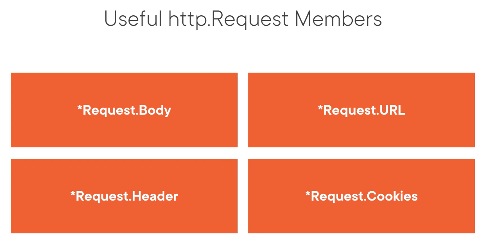

Some of the more useful Request members that I've found are the Request.Body. So if a request contains information, a lot of times that information is encoded in the request's body, so we can gain access to that information directly. We also have the Request.URL. So whether we're using parametric routing or other information about the URL, such as query parameters that are coming in, Gin does make that available to us, and that can be useful for us to explore as well. We also have all of the request headers that are available to us, and if any cookies are coming in with the request, little pieces of information such as session tokens or user identification tokens, those cookies are going to be provided with that Request object as well.
### Retrieving Route Parameters
There are three primary mechanisms that Gin offers us to retrieve data from the request. We can retrieve data from the URL path, we can retrieve data from query parameters from the URL, and then if there's a form post, so if the request body contains a posted form, then Gin offers us APIs to access that form data as well.
```go
// https://vacationtrack.info/users/tricia

router.GET("/users/:username", func(c *gin.Context){
    c.Param("username")         // tricia (Retrieve a parameter for URL path)

    c.Params.ByName("username") // Longer way to retrieve parameter from URL path

    c.Params.Get("username")    // tricia, true

    c.Params.Get("name")        // "", false
})
```
### Retrieving Query Parameters
Now let's take a look at how to extract data from the URL's query parameters. So this is a very similar API than what we just saw with parameters. We're going to start with our gin.Context, and then we can use the Query method on the context to retrieve a query parameter by its name. And if that's found, then we're going to get that string back. We can also use the QueryArray method. If multiple query parameters come up using the same key, then Gin is going to, normally with the Query method, return only the first instance. With the QueryArray, it's going to assemble all of those instances into a slice for us to work with. Then we also have the QueryMap, which allows us to retrieve the query parameters that are encoded as a map.
```go
var c *gin.Context

c.Query(key string) string              // Retrieve first query parameter for key

c.QueryArray(key string) []string       // Retrieve all query parameters for key

c.QueryMap(key string) map[string]string    // Retrieve query parameters encoded as map

c.DefaultQuery(key, default string) string  // Retrieve query parameters is present, otherwise return "default"
```
```go
// https://vacationtrack.info/users?username=Arthur&username=Tricia&scheduled[January]=0&scheduled[February]=0

router.GET("/users", func(c *gin.Context) {
    username := c.Query("username")         // Arthur

    username := c.QueryArray("username")    // [Arthur Tricia]

    scheduled := c.QueryMap("scheduled")    // map[January:0 February:0]

    otherQuery := c.DefaultQuery("foo", "bar")  // bar
})
```
### Retrieving Post Form Data
The final method that I want to show you to retrieve data from the request is if the data is coming in as a posted form. Now this API is very similar to working with queries.
```go
var c *gin.Context

// Retrieve first form value for key
c.PostForm(key string) string

// Retrieve all form values for key
c.PostFormArray(key string) []string

// Retrieve form values encoded as map
c.PostFormMap(key string) map[string]string

// Retrieve form value if present, otherwise return "default"
c.DefaultPostForm(key, default string) string
```
So if we start with that Context, instead of a Query method, we've got a `PostForm` method, and once again, we're going to provide a key and we're going to get that value back out. Gin is going to look in the request body and it's going to see if there's a posted form. If it finds it, it's going to retrieve it back for us. `PostFormArray` is like QueryArray, so we're going to provide the key, and if there are multiple values with that same key, then Gin is going to wrap those up in a slice and it's going to hand us the slice with all of those values. And then `PostFormMap` is the same as the QueryMap, where if the data is coming in and the PostForm has a name and then in square brackets it's got different keys, Gin will interpret that and it's going to create a map for us. And then of course we've got the `DefaultPostForm`, which we can provide a key and then a default value. If that value is not present in the incoming request, then Gin is going to provide us that default value, otherwise, it'll provide us the value that's coming in with the request. 
>So as you can see, this is very similar API to working with queries, but it's going to allow us to access data that's encoded in the `request body`.
```go
// Request body
// username=Arthur&username=Tricia&scheduled[January]=0&scheduled[February]=0

router.GET("/users", func(c *gin.Context) {
    username := c.PostForm("username")         // Arthur

    username := c.PostFormArray("username")    // [Arthur Tricia]

    scheduled := c.PostFormMap("scheduled")    // map[January:0 February:0]

    otherQuery := c.DefaultPostForm("foo", "bar")  // bar
})
```
>Now the only exception when we're working with forms versus queries is forms can contain files that have been uploaded to our service.

So there's some additional APIs that we can take advantage of to access those files. So once again we're going to start with that Context, and then with the Context we can call the `FormFile` method. The `FormFile` takes the name of the file that was uploaded and it's going to return an instance of something called a `FileHeader`.
```go
var c *gin.Context
c.FormFile(name string) (*multipart.FileHeader, error)
```
The other way that we can work with these forms that have uploaded files is by using the `MultipartForm` method on the Context. This is going to return a form object, and that form object contains two properties. Those two fields are the value field. The `Value` field is going to give us a map that's going to give us access to all of the raw data, the simple values that were posted with this form. So if there are input tags that are supplying individual values, then this is where we're going to access those. The `File` field is the other field, and that's another map, and that's going to be a map of the file names, those are the keys, and then it's going to provide us pointers to these `FileHeader` objects. 
```go
form := c.MultipartForm()
form.Value          // map[string][]string
form.File           // map[string][]*FileHeader
```
So what are FileHeaders? Well, a FileHeader object has several fields associated with it. It's got the `Filename`, that's the name of the file that was actually uploaded to the service; the `Header`, that's the MIMEType of the file, so Gin is going to try and identify that MIMEType and it's going to provide that here in the Header field; the `Size`, so we can see how large the file that was uploaded is; and then we have an `Open` method on that `FileHeader` object. When we call the `Open` method, Gin is going to try and open that file, open the contents, and give us a file object that we can work with.
```go
var fh *FileHeader
fh.Filename                 // Name of file
fh.Header                   // MIMEType of file
fh.Size                     // Size of file [bytes]
fh.Open() (File, error)     // Open the file to work with it
```
An additional method that's useful to be aware of on the Context is the `SaveUploadedFile` method. So if you have an upload service where the user is going to be able to send a file to your service and you want to save that in some sort of a directory for access later, then you can use the `SaveUploadedFile`, provide the `FileHeader` and the destination, and then Gin is going to save that to your local file system for you.
```go
c.SaveUploadedFile(file *multipart.FileHeader, dst string) error
```
### Data Binding
Data binding offers us a powerful mechanism to automatically take data from the incoming request and populate a Go object with that data, so it simplifies working with those request objects and getting a lot of data, especially when there's a lot of data coming in.

So to see how this works, let's just assume that we've got a struct in our application, a User type that has two fields, a FirstName and a LastName. And then what we want to bind to that is a JSON message that looks like this, where we've got two fields, FirstName and LastName, and then we've got values for those. So the way that we're going to do this with Gin is we're going to start by applying some `field tags`. These field tags are specially formatted strings that can be assigned after a field in a struct, as you see here. 
```go
type User struct {
    FirstName string    `json:"firstname" binding:"-"``
    LastName string     `json:"lastname" binding:"-"`
}

jsonMsg := `{
    "firstname": "Arthur",
    "lastname": "Dent"
}`
```
We start with `backticks`, and then we provide a name for the tag. In this case, the first field tag is json, and then we provide the value for that tag in quotation marks. So then we've got a second field tag, binding, and in this case, both of our fields have a binding value of ‑. So this is the basic syntax that we use for field tags.

So the way that we're going to use this is we're going to have our gin.Context and we're going to declare a user variable.
```go
var c *gin.Context
var user User
err := c.ShouldBindJSON(&user)      // err != nil if binding fails
err = c.MustBindJSON(&user)         // err != nil and context aborted if binding fails
```
Then we're going to call a method on the Context such as ShouldBindJSON, passing in a reference to that user object. What Gin is going to do is it's going to try and take the request, look for JSON information in the request body, and then use that data to populate our User object. If the binding fails, it's going to return an error, otherwise, it will return a User object that's populated with, in this case, the first name Arthur and the last name Dent. Now this ShouldBindJSON is going to be an optional, it's going to return an error if this fails. If the operation must succeed, then you can use the MustBindJSON. This is a much more aggressive approach to binding, and what it's going to do is if the binding operation fails is it's going to mark the request as failed and it's going to send an error back to the requester. Your method will still continue, but it's going to tell the requester that the operation has failed. ShouldBindJSON is a little bit more mild and allows you to have a little bit more control over the response.

So we have quite a few binding methods available to us with Gin.

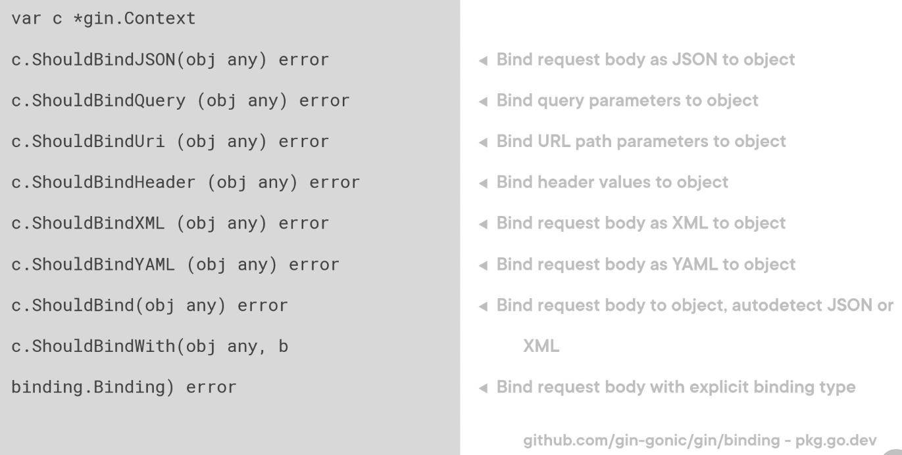

If we have a Context, we can, as we've seen, bind to JSON using the `ShouldBindJSON` method. We can also bind with data from the query parameters by using the `ShouldBindQuery`. `ShouldBindUri` tries to bind an object to information encoded as parameters in the URL path. `ShouldBindHeader` will bind an object to information in the request header, `ShouldBindXML` is similar to `ShouldBindJSON`, but it's going to assume that the data is encoded as an XML representation. Similarly, we've got a `ShouldBindYAML` method that's going to look for YAML data. And then we also have an autodetect feature. So if we use `ShouldBind` and pass in an object that we want to be populated, Gin is going to look in the request body and it's going to try and detect if it's JSON or XML and choose the appropriate strategy for us. Then we also have some flexibility using the `ShouldBindWith` method. `ShouldBindWith` allows us to provide a binding. The binding package is a subpackage of Gin, and it defines a lot of different binding strategies. So we have these first class methods like JSON, Query, Uri, but the binding package, as you can see here at the bottom of the slide, the binding package exposes quite a few more different bindings and even exposes an interface so you can create bindings of your own.

Now there are generally three different binding strategies that Gin makes available to us. 
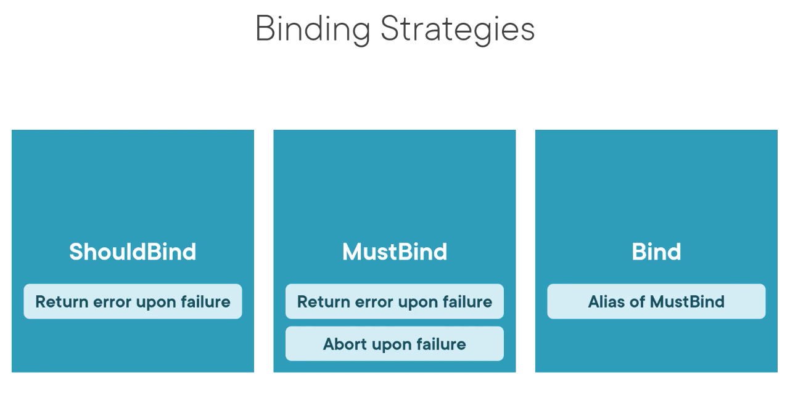
There's `ShouldBind`. ShouldBind returns an error upon failure. So it's going to attempt to bind from whatever source you supply to the object that you provide, and if that fails, then it's going to return an error for you to manage.

`MustBind`, as we saw earlier, it is going to return an error upon failure, but it's going to abort the request, so the requester is going to see a response saying that their request failed. And then we also have the Bind method, which is simply an alias of MustBind.

So if you use the `Bind` family of functions, those are going to be very similar to the MustBind family of functions. And you'll find with MustBind you're going to find everything that we saw with ShouldBind, so you'll have a `MustBindJSON`, `MustBindXML`, and so on. 
### Data Validation
Gin allows us to go a step beyond binding and include data validation in a very, very simple manner. If we have a struct defined, such as the one you see here, we can use the `binding` field tag to set up the data validation that's occurring. So when we set the value to `-`, that's going to indicate that we have an optional field. We can also provide the string `required`, and when Gin sees that, it's going to assume that the field is required.  

Another option that might be useful is using the `oneof` validation. So oneof, as you can see here, we've got two values, admin and employee, so this Role field, when it comes in, it has to have one of these two values, otherwise, the user is going to fail validation, and there are a lot of validations that Gin takes advantage of. If you go to `go‑playground/validator`, you'll be able to see all of the validation rules that you can use and apply into that binding field tag to ensure that your data aligns exactly with your business rules.
```go
type User struct {
    FirstName   `binding:"-"`                      // Optional field
    LastName    `binding:"required"`               // Required field
    Role        `binding:"oneof=admin employee"`   // Must be either "admin" or "employee"
}
```

Additionally, if you happen to run into a scenario where you need another validation, something that's not provided, Gin also allows us to create what are called `custom validators`.

We can create something called a `validator.func` that comes from that validator package. That's a function that takes a `field level` and returns a Boolean. Then in our main function, what we'll do is we'll create a router and then we register the validator like we see here. 
```go
import (
    "github.com/gin-gonic/binding"
    "github.com/go-playground/validator/v10"
)

var myValidator validator.Func = func(fl validator.FieldLevel) bool { ... }

func main() {
    router := gin.Default()

    if v, ok := binding.Validator.Engine().(*validator.Validate); ok {
        v.RegisterValidation("myvalidator", myValidator)
    }
}

type MyType struct {
    MyField `binding:"required, myvalidator"`
}
```
So we're going to check to make sure that we're using the Validate engine from the validator package so that we have the correct type. Once we have that, we can call the `RegisterValidation` method on that validate object passing in the name of the validator that's going to be the string and then the function that's actually going to perform the validation. Once we have that, we can then use that custom validator name in the field tag that we want to apply the validation to like you see here. So MyField would be set as a required field and it will be validated additionally against our custom validator.
## Generating Responses
### Sending Files
The first type of unstructured data that we're going to talk about is how to respond to a request with data from a file. So Gin offers us three primary ways that we can do that: 
* `File` method
* `FileFromFS` method
* `FileAttachment` method

So if we start with a Context, we're going to find the `File` method is a method on that Context. And if we simply provide the path relative to our current working directory, then Gin is going to find that file, and it's going to stream that file's data as the response. 

The `FileFromFS` method is similar, but instead of assuming that our file is kept on our local storage system, we're going to be able to provide the file system that Gin is going to look in. So this is useful if you've got embedded file systems or if your file systems are a little bit more complicated than sitting in your local storage device. 

The `FileAttachment` method is similar to the `File` method, but instead of just serving up the file and its contents directly to the browser, Gin is going to provide some additional headers that are going to tell the browser that this is meant to be downloaded as an attachment. So the browser is not going to try and render that result. It's just going to prompt the user to download those results.

```go
var c *gin.Context

// Stream file contents from disk into response body
c.File(filepath string)             

// Stream file content from http.FileSystem into response body
c.FileFromFS(filepath string, fs http.FileSystem)

// Send file as attachement
c.FileAttachment(filepath, filename string)
```
An example:
```go
router.GET("/reports", func(c *gin.Context) {
    c.File("/path/to/report.csv")

    fs := gin.Dir("./root/of/filesystem", true)
    c.FileFromFS("./reportfromfs.csv", fs)

    c.FileAttachment("/path/to/attachment.csv", "nameonclient.csv")
})
```
### Sending Arbitrary Data
Sometimes the data that we want to send back with a response isn't conveniently contained within a file. Sometimes it's just data that our web service generates. So how can we send that back? 

Well, Gin offers us three different methods to handle that:
* `Data` method
* `DataFromReader` method
* `Stream` method

So starting with our Context once again, the `Data` method has this signature here. We're going to start by providing the status code, so was the response 200 OK or was there some sort of an error? Then we're going to provide the `contentType` and then the data that we want to send back with the response as a byte slice in that third parameter.
```go
var c *gin.Context

// Stream data into response body
c.Data(code int, contentType string, data []byte)
```
If we have a data source that we want to stream from, then we can use the `DataFromReader` method. Now this is a little bit more complicated. We're going to provide that `code`, then we need to provide the `contentLength`, so Gin needs to know how large the response is going to be so it can set the appropriate contentLength header with the response. Then, once again, we provide a `contentType` and then the reader. The `reader` is going to be the source of the data that's going to stream back with the response. And then we do have a final parameter that we can provide if we want to supply some extra headers. Now this is an optional parameter, so you don't have to supply those, but if you do have them, you can go ahead and use that. 
```go
var c *gin.Context

// Stream data from io.Reader into response body
c.DataFromReader(code int, 
        contentLength int64, 
        contentType string,
        reader io.Reader,
        extraHeaders map[string]string)

// Stream response to io.Writer, returns true if client disconnected in middle of stream
c.Stream(step func(w io.Writer) bool) bool
```
And then finally, if the response is being generated dynamically, we can use the `Stream` method. The `Stream` method takes a function as its only argument, that function is called step, and it has the responsibility of generating every block of the stream.
### Streaming Response Data

### Rendering HTML
The first type of structured data that I want to talk about is how we can render HTML as the response to a request. Now this happens in two steps with Gin.

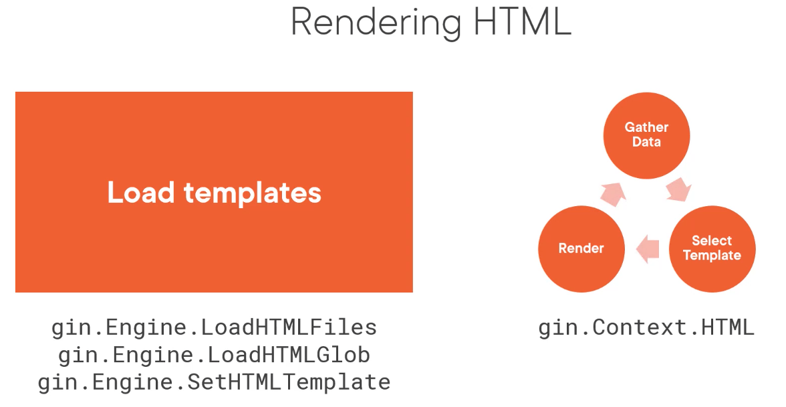

The first step is where we need to load our HTML templates. And to do this, we've got three different methods available:
* `LoadHTMLFiles` method
* `LoadHTMLGlob` method
* `SetHTMLTemplate` method. 

LoadHTMLFiles, we're going to simply provide a comma‑delimited list of the HTML templates that we want to load.

Glob will take a file pattern, so we can use, for example, an asterisk wildcard so we can load an entire directory of templates.

And then SetHTMLTemplate is useful if for some reason you already have a template object in your application, you can register that with the Gin engine by using that method.

Once we have all the templates loaded, it's time to enter the rendering loop.

So what Gin will do is we'll have a handler that will say that we want to render HTML as the result, then we will gather the data, we'll provide that data to the template, and then when the data and the template are executed together, we're going to render that result, and then we're going to send that result back to the requester, and then presumably they're going to make another selection, and that's going to trigger us to fire another handler where we gather more data, bind it to a template, and render the next page. So we enter this rendering loop when we're working with HTML, especially if we're building web applications with Gin. And the way that we access that within a handler is using the HTML method on the Context. So we register templates on the engine, or we've been talking about it as the router. That's where we're going to find the methods to register templates. However, to render, we're within a handling function, and so we're going to use that `gin.Context` to find the HTML method.

Well, we're going to typically work with the `html/template` package. That's part of the standard library, and that's where templates are often defined. Then, if we have a main function with a router to find within it, we can use the `LoadHTMLFiles` method as you see here, and this is simply going to take the comma‑delimited list of templates. These aren't actually HTML files. These are Go templates that we will eventually render HTML from. Then the `LoadHTMLGlob` method is similar, but notice that its argument contains a wildcard. Gin will use that. In this case, it will inspect the templates directory, and it will load each one of the templates as a template that we can access within our handlers. And then we can also, if we've got that template package imported from the standard library, we can use its ParseFiles function to parse templates. That's going to generate a template object, and then we can register that template object using the `SetHTMLTemplate` method like you see here.

```go
import "html/template"

func main() {
    router := gin.Default()

    router.LoadHTMLFiles("./templates/index.tmpl", "./templates/users.tmpl")

    router.LoadHTMLGlob("./templates/*")

    t := template.Must(template.ParseFiles("./templates/index.tmpl", "./templates/users.tmpl",))
    router.SetHTMLTemplate(t)
}
```

Example:

```go
var html = `
    <html>
    <head></head>
    <body>
        <h1>Hello, {{.name}}</h1>
    </body>
    </html>
`

func main() {
    router := gin.Default()
    template := template.New("index.tmpl")
    template.Parse(html)
    router.SetHTMLTemplate(template)

    router.GET("/hello", func(c *gin.Context) {
        c.HTML(http.StatusOK,
            "index.tmpl",
            map[string]any{"name":"Gophers"})
    })
}
```

### Sending other Structured Data
 So, on the context within a handler, we have, for example, the string method. The string method takes a status code. This is going to be the status code for the response, it's going to take a formatting string, and it's going to allow us to provide values into that formatting string. If you're familiar with the printf function from the FMT package, this works in a very similar way. We also have the JSON method. We've seen this actually a couple of times where we'll provide our status code again and then an object, and that Go object is going to be rendered into a JSON representation. Similarly, the XML method will do the same thing, but it's going to render as XML. YAML will render as YAML. Protobuf will actually render as a protocol buffer file. However, we do have the constraint that the object that's provided here does need to be a Protobuf object. Protocol buffers use code generation to enable the types to be encoded and decoded from the protocol buffer format, so you do need to provide a type that is specifically designed to work with protocol buffers in this case. And then we have several other auxiliary methods to handle different JSON scenarios. So we've got secure JSON, JSONP, ASCII JSON, and pure JSON available. And then if you need something else, a more generic rendering method is also provided. And in this case, we're going to provide a render object from Gin's render package. So you can go to that package, and you'll see that there are even more formats that Gin supports that we can render data with.

 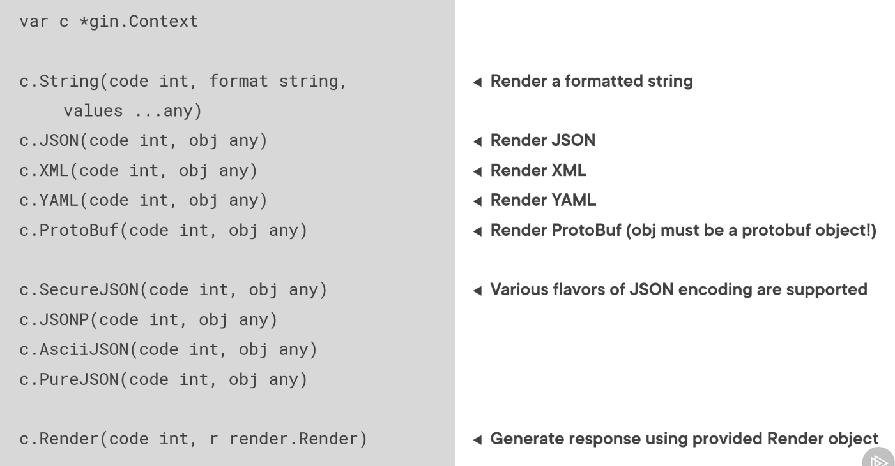
## Using Middleware
### What is Middleware?
TO DO
## Testing and Error Handling
### Testing Handlers
Testing request handlers in Gin is the same as testing handlers in any Go web service.

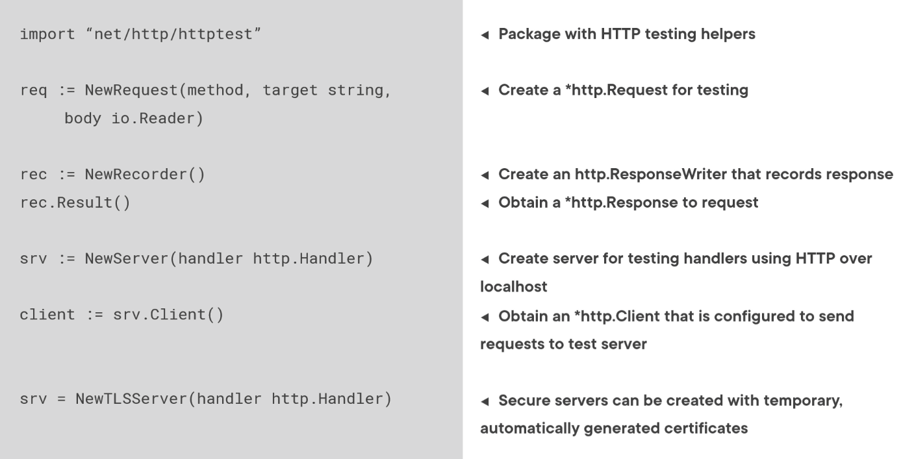

We're going to start by importing the `net/http/httptest` package from the standard library. This package contains three primary tools that are going to help us test our web services. The first is the `NewRequest` function. The `NewRequest` function takes three parameters, the method, so this is the HTTP method that we want to use, the target, which is the URL path that we want to hit, and then an optional io.Reader. The reader is going to represent the data that's going to come in with our synthetic request body. The `NewRecorder` function is a valuable tool that will create a mock of a `ResponseWriter`. A `ResponseWriter` is the object that we use to write out to the response stream, so we can send status codes, we can send the response body, all of that through the ResponseWriter. And the `NewRecorder` gives us that object that meets that interface, but gives us additional functionality so that we can make assertions against what actually got generated by our handler. Specifically, the recorder has a `Result` method on it. That's not part of the `ResponseWriter` interface, but this is going to allow us to obtain a pointer to an HTTP response object, which is going to contain the response headers, the response body, and so on. If you need to test your handlers using actual HTTP, the `NewRequest` and `NewRecorder` functions are meant for unit testing, testing our handlers in isolation. However, if you do want to do a more functional test using your network stack, then the NewServer function is what you're looking for. This will generate a server that will actually allow you to send HTTP requests to your handler and get responses back over HTTP making sure that the entire system is working properly. In order to get a client for that server, which is potentially challenging because we don't actually know what TCP port is secured when we call the NewServer function, Go determines that for us, in order to get a client that's able to talk to that server, we can use the Client method on that server. And then finally, if you're using an application that's using Transport Layer Security, there's actually a new TLS server function that works the same as NewServer, but it's going to use automatically generated certificates so it can handle HTTPS traffic without you having to worry about creating test certificates.
#### Testing Handlers without HTTP
```go
func TestWithoutHTTP(t *testing.T) {
    router := gin.New()
    router.GET("/users", func(c *gin.Context) {
        c.JSON(gin.H({
            "user1": "adent",
        }))
    })

    req := httptest.NewRequest("/users", http.MethodGet, nil)
    rec := httptest.NewRecorder()

    router.ServerHTTP(rec, req)

    res := rec.Result()

    // assertion go here
}
```
#### Testing Handlers with HTTP
```go
func TestWithHTTP(t *testing.T) {
    router := gin.New()
    router.GET("/users", func(c *gin.Context) {
        c.JSON(gin.H({
            "user1": "adent",
        }))
    })

    srv := httptest.NewServer(router)
    defer srv.Close()

    client := srv.Client()

    res, err := client.Get(srv.URL + "/users")

    // assertions go here
}
```
### Handling errors
Error handling with web services works slightly differently than when we work with errors in other types of Go programming. Normally with the Go program, when a function might return an error, we're going to return an error parameter as the final result. Well, with request handlers, we don't have any return values, and when we're working with middleware, we need a different mechanism because we're having this nested result, so Gin provides us a different solution for managing and tracking errors in our applications. We're going to start with a gin.Context, so we're working within a handler or a piece of middleware, and then the context has an Error method on it. So if an error is generated by your application, you can simply call the Error method on the context and pass that error into it. This is going to allow Gin to accumulate all the errors that happened during that request, and then we can create an error handler later that's going to inspect those errors and see if anything needs to be done with it. Some of the things that we can do with it if we have a Gin error object, we can call the JSON method on it. That's going to render the error as a JSON result. We can attach metadata to the error, so this is slightly different than error objects in normal Go applications. We've got a more powerful construct where we can attach metadata to that error. And then we can also set an error type. Gin comes with a library of standard error types that allow it and us to understand what type of error was generated, and it might help us to understand how to manage that error and prevent a recurrence.

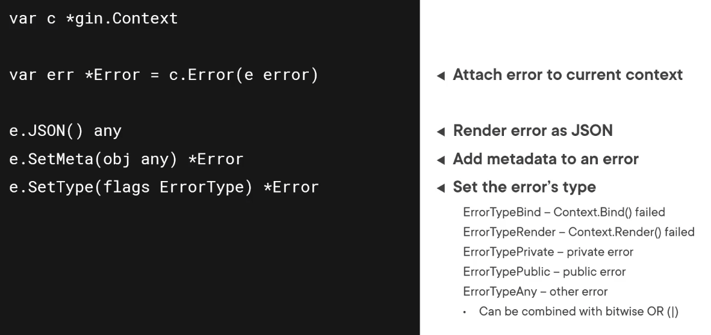

### Managing panics
Panics in Go are relatively rare; however, they do happen, and we need to make sure that our applications are prepared to manage them when they do. Fortunately, Gin provides us multiple options so that we can customize the panic recovery mechanisms that fit our application's needs. The most basic service that Gin provides is using the recovery middleware, which we can create using the Recovery function from the Gin package. This middleware will recover from the panic, and it will automatically send a 500 response, an internal server error response, back to the requester, and it will record the event in the application's log. If you want to record the event in a custom location, then you can use the RecoveryWithWriter middleware. This middleware takes an io.Writer, and it will record the event not just to the application log, but to the custom writer that you provide as well. If you need custom behavior to recover from the errors, we do have a CustomRecovery middleware. This constructor function takes a RecoveryFunc, and that function gets invoked whenever a panic occurs in the application. It will also record the event in the application log so that you don't have to worry about recording that yourself. We also have the CustomRecoveryWithWriter. This is the combination of the second and the third options. This takes a writer that the event is going to be recorded out too, and it takes that recovery function in, which allows us custom behavior to recover from the panic. By the way, that recovery function does have this signature here. It receives the Context so you have access to everything that was going on with the request up until that point, and then it receives the error. That error is actually the object that's returned by the recover method, so it's not a Go error object. It's whatever was returned by the recovery function, which means it is whatever argument was passed into the panic function itself.

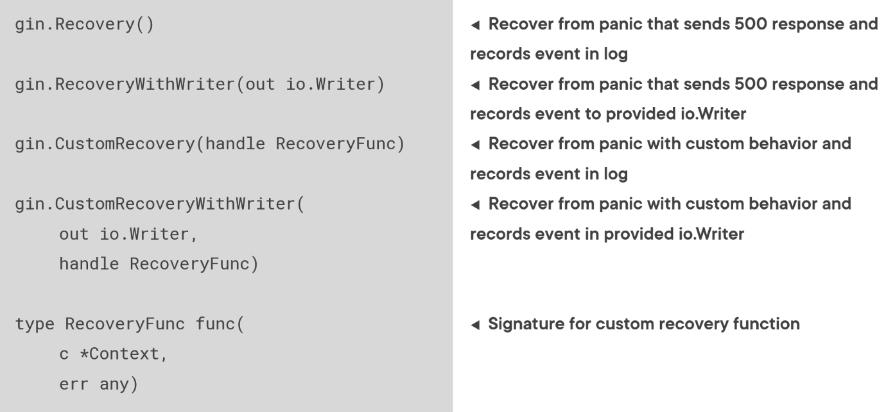
