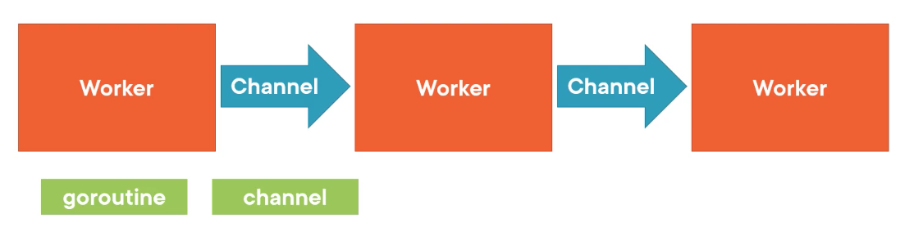

# GOLANG. My Notes
## Index
* [The Go Toolchain and install Go](#the-go-toolchain-and-install-go)
* [Variables and Simple Data Types](#variables-and-simple-data-types)
	* [The String Type](#the-string-type)
	* [Numeric Types](#numeric-types)
	* [Boolean Types](#boolean-types)
	* [Error Types](#error-types)
	* [Declaring Variables](#declaring-variables)
	* [Type Conversions](#type-conversions)
	* [Go Operators and Punctuation](#go-operators-and-punctuation)
	* [Common Arithmetic Operators](#common-arithmetic-operators)
	* [Common Comparison Operators](#common-comparison-operators)
	* [Constants, constant expressions and Iota](#constants-constant-expressions-and-iota)
	* [Pointers](#pointers)
* [Aggregate Data Types (Collections)](#aggregate-data-types-collections)
	* [Array Type](#array-types)
	* [Slice Type](#slice-types)
	* [Map Type](#map-types)
	* [Struct Type](#struct-types)
* [Looping](#looping)
	* [Basic Loops](#basic-loops)
		* [Infinite Loops](#infinite-loops)
		* [Loop till Condition](#loop-till-condition)
		* [Counter-based Loops](#counter-based-loops)
	* [Looping trough Collection](#looping-through-collection)
* [Branching](#branching)
	* [If Statements](#if-statements)
	* [Switch Statements](#switch-statements)
	* [Deferred Functions](#deferred-functions)
	* [Panic and Recover](#panic-and-recover)
	* [Goto Statement](#goto-statements)
* [Organizing Programs](#organizing-programs)
	* [Functions](#functions)
		* [Function Signature](#function-signature)
		* [Parameters and Arguments](#parameters-and-arguments)
		* [Variadic Parameters](#variadic-parameters)
		* [Passing Values and Pointers as Parameters](#passing-values-and-pointers-as-parameters)
		* [Returning Multiples Values](#returning-multiple-values)
		* [Named Return Values](#named-return-values)
	* [Packages](#packages)
	* [Documenting Code](#documenting-code)
* [Object Orientation and Polymorphism](#object-orientation-and-polymorphism)
	* [Method](#method)
	* [Method Receivers](#method-receivers)
	* [Generic Programming](#generic-programming)
* [Error Management](#error-management)
	* [Errors in Go](#errors-in-go)
	* [Error Mechanics](#error-mechanics)
	* [Error vs Panics](#error-vs-panics)
* [Concurrency](#concurrency)
* [CSP (Communicating Sequential Process)](#csp-communicating-sequential-process)
* [Goroutines](#goroutines)
* [WaitGroups](#waitgroups)
* [Channels](#channels)
* [Testing](#testing)
	* [Testing and validating input in Go](#testing-and-validating-input-in-go)
* [Lecturas interesantes]()
	* [The Complete Guide to Context in Golang: Efficient Concurrency Management](https://medium.com/@jamal.kaksouri/the-complete-guide-to-context-in-golang-efficient-concurrency-management-43d722f6eaea)
	* [Understanding the Power of Go Interfaces: A Comprehensive Guide](https://medium.com/@jamal.kaksouri/understanding-the-power-of-go-interfaces-a-comprehensive-guide-835954101b7e)
	* [A Comprehensive Guide to Pointers in Go](https://medium.com/@jamal.kaksouri/a-comprehensive-guide-to-pointers-in-go-4acc58eb1f4d)
	* [Mastering Type Assertion in Go: A Comprehensive Guide](https://medium.com/@jamal.kaksouri/mastering-type-assertion-in-go-a-comprehensive-guide-216864b4ea4d)
---
## The Go Toolchain and Install Go
* The Go toolchain
    * Build
    * Test
    * Manage Code
    * Tracing
    * Profile
    * Dependencies
    * Documentation
* The CLI --> `go`
```bash
~> go
Go is a tool for managing Go source code.

Usage:

	go <command> [arguments]

The commands are:

	bug         start a bug report
	build       compile packages and dependencies
	clean       remove object files and cached files
	doc         show documentation for package or symbol
	env         print Go environment information
	fix         update packages to use new APIs
	fmt         gofmt (reformat) package sources
	generate    generate Go files by processing source
	get         add dependencies to current module and install them
	install     compile and install packages and dependencies
	list        list packages or modules
	mod         module maintenance
	work        workspace maintenance
	run         compile and run Go program
	test        test packages
	tool        run specified go tool
	version     print Go version
	vet         report likely mistakes in packages

Use "go help <command>" for more information about a command.

Additional help topics:

	buildconstraint build constraints
	buildmode       build modes
	c               calling between Go and C
	cache           build and test caching
	environment     environment variables
	filetype        file types
	go.mod          the go.mod file
	gopath          GOPATH environment variable
	gopath-get      legacy GOPATH go get
	goproxy         module proxy protocol
	importpath      import path syntax
	modules         modules, module versions, and more
	module-get      module-aware go get
	module-auth     module authentication using go.sum
	packages        package lists and patterns
	private         configuration for downloading non-public code
	testflag        testing flags
	testfunc        testing functions
	vcs             controlling version control with GOVCS

Use "go help <topic>" for more information about that topic.
```

* Install Go in VSC
    * Install VSC from [link](https://code.visualstudio.com/Download)
    * Install Go extension in VSC
    * Install/Update Tools in VSC. Command pallete --> `>Go: Install/Update Tools`

## Variables and Simple Data Types
I'm talking about data types that contain one, and only one value:
	* Strings
	* Numbers
	* Booleans
	* Errors
### The String Type
> Strings in Go represent a collection of one or more UTF-8 code points. They contain one or more letters or numbers or other symbols that we might use depending on the languages that your users are using.

`"this is a string"` **interpreted string**

`'this is also a string'` **raw string**
```go
"this is an escape character: \n it creates a newline"
this is an escape character:
 it creates a newline

`this is an escape character: \n it creates a newline`
this is an escape character: \n it creates a newline
```
### Numeric Types
Numbers in Go come in four basic categories.

|Category|Type|Examples|
|--------|----|--------|
|Integers|int|99, 0, -937|
|Unsigned integers|uint|0, 15, 7329|
|Floating point numbers|float32, float64|6.02e23, 3.1415, 0.25|
|Complex numbers|complex64, complex128|1+2i, 0.833i, 6.02e23+3.1415i|

### Boolean Types
bool in the set of boolean values, `true` and  `false`

### Error Types
> The error built-in interface type is the conventional interface for representing an error condition, with the nil value representing no error.

The error type is what's called an interface, which in Go, represents a type or a data type that has an error method on it, which means that it has the ability to report what the error was.
```go
type error interface {
	Error() string
}
```
### Declaring Variables
There are three different ways that we can declare variables in Go.
```go
var myName string			// declare variable
var myName string = "Mike"	// declare and initialize

var myName = "Mike"			// initialize with inferred type
myName := "Mike"			// short declaration syntax
```
### Type Conversions
```go
var i int = 32
var f float32

f = i				// error! - Go doesn't support implicit conversion
f = float32(i)		// type conversions allow explicit conversion
```
### Go Operators and punctuation
```go
+    &     +=    &=     &&    ==    !=    (    )
-    |     -=    |=     ||    <     <=    [    ]
*    ^     *=    ^=     <-    >     >=    {    }
/    <<    /=    <<=    ++    =     :=    ,    ;
%    >>    %=    >>=    --    !     ...   .    :
     &^          &^=          ~
```
### Common Arithmetic Operators
```go
a, b := 10, 5		// Go allows multiple variables to be initialized at once!

c := a + b			// 15 --> addition
c = a - b			// 5  --> subtraction
c = a * b			// 50 --> multiplication
c = a / b			// 2  --> division
c = a / 3			// 3  --> integer division used for integers
c = a % 3			// 1  --> modulus (remainder of integer division)
d := 7.0 / 2.0		// 3.5--> decimal results given for floating point numbers
```
### Common Comparison Operators
```go
a, b := 10, 5

c := a == b			// false - equality
c = a != b			// true - inequality
c = a < b			// false - less than
c = a <= b			// false - less than or equal
c = a > b			// true - greater
c = a >= b			// true - greater than or equal
```
### Constants, Constant Expressions, and Iota
Constants are declared like variables, but with the const keyword.

Constants can be character, string, boolean, or numeric values.

Constants cannot be declared using the := syntax.
```go
const a = 42						// constant (implicity typed)
const b string = "hello, world"		// explicitly typed constant
const c = a							// one constant can be assigned to another
const (								// group of constants
	d = true
	e = 3.14
)
const (
	a = "foo"
	b						// "foo",unassigned constant receive previous value
)
const c = 2 * 5						// 10 constant expression
const d = "hello, " + "world"		// must be calculable at compile time
const e = someFunction()			// this won't work, can't be evaluated at compile time
```

Go’s iota identifier is used in const declarations to simplify definitions of incrementing numbers. Because it can be used in expressions, it provides a generality beyond that of simple enumerations.

The value of iota is reset to 0 whenever the reserved word const appears in the source (i.e. each const block) and incremented by one after each ConstSpec e.g. each Line. This can be combined with the constant shorthand (leaving out everything after the constant name) to very concisely define related constants.
```go
const (
	c0 = iota  // c0 == 0
	c1 = iota  // c1 == 1
	c2 = iota  // c2 == 2
)

const (
	d0 = 34		// d0 == 34 (iota == 0, unused)
	d1 = 45		// d1 == 45 (iota == 1, unused)
	d3 = iota	// d3 == 2  (iota == 2)
	d4			// d4 == 3  (iota == 3)
)

const (
	a = 1 << iota  // a == 1  (iota == 0)
	b = 1 << iota  // b == 2  (iota == 1)
	c = 3          // c == 3  (iota == 2, unused)
	d = 1 << iota  // d == 8  (iota == 3)
)

const (
	u         = iota * 42  // u == 0     (untyped integer constant)
	v float64 = iota * 42  // v == 42.0  (float64 constant)
	w         = iota * 42  // w == 84    (untyped integer constant)
)

const x = iota  // x == 0
const y = iota  // y == 0
```
### Pointers

```go
// Go supports <em><a href="https://en.wikipedia.org/wiki/Pointer_(computer_programming)">pointers</a></em>,
// allowing you to pass references to values and records
// within your program.

package main

import "fmt"

// We'll show how pointers work in contrast to values with
// 2 functions: `zeroval` and `zeroptr`. `zeroval` has an
// `int` parameter, so arguments will be passed to it by
// value. `zeroval` will get a copy of `ival` distinct
// from the one in the calling function.
func zeroval(ival int) {
	ival = 0
}

// `zeroptr` in contrast has an `*int` parameter, meaning
// that it takes an `int` pointer. The `*iptr` code in the
// function body then _dereferences_ the pointer from its
// memory address to the current value at that address.
// Assigning a value to a dereferenced pointer changes the
// value at the referenced address.
func zeroptr(iptr *int) {
	*iptr = 0
}

func main() {
	i := 1
	fmt.Println("initial:", i)

	zeroval(i)
	fmt.Println("zeroval:", i)

	// The `&i` syntax gives the memory address of `i`,
	// i.e. a pointer to `i`.
	zeroptr(&i)
	fmt.Println("zeroptr:", i)

	// Pointers can be printed too.
	fmt.Println("pointer:", &i)
}

```
Built-in `new` function creates pointer to anonymous variable.
```go
c = new(int)
```
> **Pointers are primaryly used to share memory**.
>
> Use copies whenever possible.
---
## Aggregate Data Types (Collections)
### Array Types
An array is a fixed, sized collection of data elements that all have the same type.
```go
var arr [3]int			// array of 3 ints
fmt.Println(arr)		// [0 0 0]
arr = [3]int{1, 2, 3}	// array literal

fmt.Println(arr[1])		// 2
arr[1] = 99				// update value
fmt.Println(arr)		// [1 99 3]

fmt.Println(len(arr))	// 3
```
```go
arr := [3]string{"foo", "bar", "baz"}

arr2 := arr				// arrays are copied by value
fmt.Println(arr2)		// {"foo" "bar" "baz"}

arr[0] = "quux"
fmt.Println(arr)		// {"quux" "bar" "baz"}
fmt.Println(arr2)		// {"foo" "bar" "baz"}

arr == arr2				// false - arrays are comparable
```
```go
// You can also have the compiler count the number of
// elements for you with `...`
b = [...]int{1, 2, 3, 4, 5}
fmt.Println("dcl:", b)					// dcl: [1 2 3 4 5]

// If you specify the index with `:`, the elements in
// between will be zeroed.
b = [...]int{100, 3: 400, 500}
fmt.Println("idx:", b)					// idx: [100 0 0 400 500]

// Array types are one-dimensional, but you can
// compose types to build multi-dimensional data
// structures.
var twoD [2][3]int
for i := 0; i < 2; i++ {
	for j := 0; j < 3; j++ {
		twoD[i][j] = i + j
	}
}
fmt.Println("2d: ", twoD)				// 2d:  [[0 1 2] [1 2 3]]

// You can create and initialize multi-dimensional
// arrays at once too.
twoD = [2][3]int{
	{1, 2, 3},
	{1, 2, 3},
}
fmt.Println("2d: ", twoD)				// 2d:  [[1 2 3] [1 2 3]]
```
### Slice Types
An array has a fixed size. A `slice`, on the other hand, is a dynamically-sized, flexible view into the elements of an array. In practice, slices are much more common than arrays.
The type `[]T` is a slice with elements of type `T`.
A `slice` is formed by specifying two indices, a `low` and `high` bound, separated by a colon `:`
> `a[low : high]`

```go
// _Slices_ are an important data type in Go, giving
// a more powerful interface to sequences than arrays.

package main

import (
	"fmt"
	"slices"
)

func main() {

	// Unlike arrays, slices are typed only by the
	// elements they contain (not the number of elements).
	// An uninitialized slice equals to nil and has
	// length 0.
	var s []string
	fmt.Println("uninit:", s, s == nil, len(s) == 0)			// uninit: [] true true

	// To create an empty slice with non-zero length, use
	// the builtin `make`. Here we make a slice of
	// `string`s of length `3` (initially zero-valued).
	// By default a new slice's capacity is equal to its
	// length; if we know the slice is going to grow ahead
	// of time, it's possible to pass a capacity explicitly
	// as an additional parameter to `make`.
	s = make([]string, 3)
	fmt.Println("emp:", s, "len:", len(s), "cap:", cap(s))		// emp: [  ] len: 3 cap: 3

	// We can set and get just like with arrays.
	s[0] = "a"
	s[1] = "b"
	s[2] = "c"
	fmt.Println("set:", s)										// set: [a b c]
	fmt.Println("get:", s[2])									// get: c
	w = []int{1, 2, 3}
	fmt.Println("w:", w)										// w: [1 2 3]

	// `len` returns the length of the slice as expected.
	fmt.Println("len:", len(s))									// len: 3

	// In addition to these basic operations, slices
	// support several more that make them richer than
	// arrays. One is the builtin `append`, which
	// returns a slice containing one or more new values.
	// Note that we need to accept a return value from
	// `append` as we may get a new slice value.
	s = append(s, "d")
	s = append(s, "e", "f")
	fmt.Println("apd:", s)										// apd: [a b c d e f]

	// Slices can also be `copy`'d. Here we create an
	// empty slice `c` of the same length as `s` and copy
	// into `c` from `s`.
	c := make([]string, len(s))
	copy(c, s)
	fmt.Println("cpy:", c)										// cpy: [a b c d e f]

	// Slices support a "slice" operator with the syntax
	// `slice[low:high]`. For example, this gets a slice
	// of the elements `s[2]`, `s[3]`, and `s[4]`.
	l := s[2:5]
	fmt.Println("sl1:", l)										// sl1: [c d e]

	// This slices up to (but excluding) `s[5]`.
	l = s[:5]
	fmt.Println("sl2:", l)										// sl2: [a b c d e]

	// And this slices up from (and including) `s[2]`.
	l = s[2:]
	fmt.Println("sl3:", l)										// sl3: [c d e f]

	// We can declare and initialize a variable for slice
	// in a single line as well.
	t := []string{"g", "h", "i"}
	fmt.Println("dcl:", t)										// dcl: [g h i]

	// The `slices` package contains a number of useful
	// utility functions for slices.
	t2 := []string{"g", "h", "i"}
	if slices.Equal(t, t2) {
		fmt.Println("t == t2")									// t == t2
	}
	w = append(w, 5, 10, 15)
	fmt.Println(w)												// [1 2 3 5 10 15]
	w = slices.Delete(w, 1, 3)									// remove indices 1, 2 from slice
																// [1 5 10 15]

	// Slices can be composed into multi-dimensional data
	// structures. The length of the inner slices can
	// vary, unlike with multi-dimensional arrays.
	twoD := make([][]int, 3)
	for i := 0; i < 3; i++ {
		innerLen := i + 1
		twoD[i] = make([]int, innerLen)
		for j := 0; j < innerLen; j++ {
			twoD[i][j] = i + j
		}
	}
	fmt.Println("2d: ", twoD)									// 2d:  [[0] [1 2] [2 3 4]]
}
```
### Map Types
Maps are a convenient and powerful built-in data structure that associate values of one type (the key) with values of another type (the element or value). The key can be of any type for which the equality operator is defined, such as integers, floating point and complex numbers, strings, pointers, interfaces (as long as the dynamic type supports equality), structs and arrays. Slices cannot be used as map keys, because equality is not defined on them. Like slices, maps hold references to an underlying data structure. If you pass a map to a function that changes the contents of the map, the changes will be visible in the caller.
```go
// _Maps_ are Go's built-in [associative data type](https://en.wikipedia.org/wiki/Associative_array)
// (sometimes called _hashes_ or _dicts_ in other languages).

package main

import (
	"fmt"
	"maps"
)

func main() {
	// To create an empty map, use the builtin `make`:
	// `make(map[key-type]val-type)`.
	m := make(map[string]int)

	// Set key/value pairs using typical `name[key] = val`
	// syntax.
	m["k1"] = 7
	m["k2"] = 13

	// Printing a map with e.g. `fmt.Println` will show all of
	// its key/value pairs.
	fmt.Println("map:", m)				// map: map[k1:7 k2:13]

	// Get a value for a key with `name[key]`.
	v1 := m["k1"]
	fmt.Println("v1:", v1)				// v1: 7

	// If the key doesn't exist, the
	// [zero value](https://go.dev/ref/spec#The_zero_value) of the
	// value type is returned.
	v3 := m["k3"]
	fmt.Println("v3:", v3)				// v3: 0

	// The builtin `len` returns the number of key/value
	// pairs when called on a map.
	fmt.Println("len:", len(m))			// len: 2

	// The builtin `delete` removes key/value pairs from
	// a map.
	delete(m, "k2")
	fmt.Println("map:", m)				// map: map[k1:7]

	// To remove *all* key/value pairs from a map, use
	// the `clear` builtin.
	clear(m)
	fmt.Println("map:", m)				// map: map[]

	// The optional second return value when getting a
	// value from a map indicates if the key was present
	// in the map. This can be used to disambiguate
	// between missing keys and keys with zero values
	// like `0` or `""`. Here we didn't need the value
	// itself, so we ignored it with the _blank identifier_
	// `_`.
	_, prs := m["k2"]
	fmt.Println("prs:", prs)			// prs: false 

	// You can also declare and initialize a new map in
	// the same line with this syntax.
	n := map[string]int{"foo": 1, "bar": 2}
	fmt.Println("map:", n)				// map: map[bar:2 foo:1]

	// The `maps` package contains a number of useful
	// utility functions for maps.
	n2 := map[string]int{"foo": 1, "bar": 2}
	if maps.Equal(n, n2) {
		fmt.Println("n == n2")			// n == n2
	}
}
```
> **maps are copied by reference**

> **use `maps.Clone` to clone**
```go
m := map[string]int{
	"foo":1,
	"bar":2,
	"baz":3}
m2 := m

m["foo"], m2["bar"] = 99, 42	// update values in maps
fmt.Println(m)					// map[foo:99 bar:42 baz:3]
fmt.Println(m2)					// map[foo:99 bar:42 baz:3]
								// data is shared

m == m2		// compile time error - maps are not comparable
```

### Struct Types
> Go's _`structs`_ are typed collections of fields.
>
> They're useful for grouping data together to form records.
```go
var s struct{				// declare an anonymous struct
	name string
	id 	 int
}
fmt.Println(s)				// {"" 0}

s.name = "Arthur"			// assign value to field
fmt.Println(s.name)			// query value of field
```
> Structs are copied by value
```go
type myStruct struct{
	name string
	id 	 int
}
var s myStruct
s = myStruct{
	name: "Arthur",
	id: 42
}
s2 := s						// structs are copied by value
s.name = "Tricia"
fmt.Println(s, s2)			// {"Tricia" 42}{"Arthur" 42}

s == s2						// false - structs are comparable
```
```go
// This `person` struct type has `name` and `age` fields.
type person struct {
	name string
	age  int
}

// `newPerson` constructs a new person struct with the given name.
func newPerson(name string) *person {
	// You can safely return a pointer to local variable
	// as a local variable will survive the scope of the function.
	p := person{name: name}
	p.age = 42
	return &p
}

func main() {

	// This syntax creates a new struct.
	fmt.Println(person{"Bob", 20})		// {Bob 20}

	// You can name the fields when initializing a struct.
	fmt.Println(person{name: "Alice", age: 30})		// {Alice 30}

	// Omitted fields will be zero-valued.
	fmt.Println(person{name: "Fred"})	// {Fred 0}

	// An `&` prefix yields a pointer to the struct.
	fmt.Println(&person{name: "Ann", age: 40})		// &{Ann 40}

	// It's idiomatic to encapsulate new struct creation in constructor functions
	fmt.Println(newPerson("Jon"))		// &{Jon 42}

	// Access struct fields with a dot.
	s := person{name: "Sean", age: 50}
	fmt.Println(s.name)					// Sean

	// You can also use dots with struct pointers - the
	// pointers are automatically dereferenced.
	sp := &s
	fmt.Println(sp.age)					// 50

	// Structs are mutable.
	sp.age = 51
	fmt.Println(sp.age)					// 51

	// If a struct type is only used for a single value, we don't
	// have to give it a name. The value can have an anonymous
	// struct type. This technique is commonly used for
	// [table-driven tests](testing-and-benchmarking).
	dog := struct {
		name   string
		isGood bool
	}{
		"Rex",
		true,
	}
	fmt.Println(dog)									// {Rex true}
```
## Looping
All loops in go are `for` loops.
### Basic Loops
```go
for {...}										// infinite loop
for condition {...}								// loop till condition
for initializer; test; post clause {...}		// counter-based loop
```
#### Infinite Loops
```go
i := 0
for {						// infinite loop
	fmt.Println(i)
	i += 1
}
```
#### Loop till Condition
```go
i := 0
for i < 3 {
	fmt.Println(i)
	i += 1
}
fmt.Println("Done!")
```
#### Counter-based Loops
```go
for i := 1; i < 3; i++ {
	fmt.Println(i)
}
fmt.Println("Done!")
```
### Looping through Collection
```go 
for key, value := range collection { ... }
for key := range collection { ... }
for _, value := range collection { ... }
```
> Collections are `array`, `slice` and `map`.
```go
arr := [3]int{101, 102, 103}
fir i, v := range arr {
	fmt.Println(i, v)
}
fmt.Println("Done!")
// result:
// 0 101
// 1 102
// 2 103
// Done!
```
## Branching
### If Statements
```go
if test { ... }

if test { ... }
else { ... }

if test { ... }
else if test { ... }

if test { ... }
else if test { ... }
else { ... }

if initializer; test { ... }
```
```go
// Branching with `if` and `else` in Go is
// straight-forward.

package main

import "fmt"

func main() {

	// Here's a basic example.
	if 7%2 == 0 {
		fmt.Println("7 is even")
	} else {
		fmt.Println("7 is odd")
	}

	// You can have an `if` statement without an else.
	if 8%4 == 0 {
		fmt.Println("8 is divisible by 4")
	}

	// Logical operators like `&&` and `||` are often
	// useful in conditions.
	if 8%2 == 0 || 7%2 == 0 {
		fmt.Println("either 8 or 7 are even")
	}

	// A statement can precede conditionals; any variables
	// declared in this statement are available in the current
	// and all subsequent branches.
	if num := 9; num < 0 {
		fmt.Println(num, "is negative")
	} else if num < 10 {
		fmt.Println(num, "has 1 digit")
	} else {
		fmt.Println(num, "has multiple digits")
	}
}

// Note that you don't need parentheses around conditions
// in Go, but that the braces are required.
```
And the result is:
```bash
7 is odd
8 is divisible by 4
either 8 or 7 are even
9 has 1 digit
```
### Switch Statements
Switch statements express conditionals across many branches.
```go
switch test expression {
	case expression1:
		statements
	case expression2, expression3:
		statements
	default:
		statements
}
```
```go
// _Switch statements_ express conditionals across many
// branches.
package main

import (
	"fmt"
	"time"
)

func main() {

	// Here's a basic `switch`.
	i := 2
	fmt.Print("Write ", i, " as ")
	switch i {
	case 1:
		fmt.Println("one")
	case 2:
		fmt.Println("two")
	case 3:
		fmt.Println("three")
	}

	// You can use commas to separate multiple expressions
	// in the same `case` statement. We use the optional
	// `default` case in this example as well.
	switch time.Now().Weekday() {
	case time.Saturday, time.Sunday:
		fmt.Println("It's the weekend")
	default:
		fmt.Println("It's a weekday")
	}

	// `switch` without an expression is an alternate way
	// to express if/else logic. Here we also show how the
	// `case` expressions can be non-constants.
	t := time.Now()
	switch {
	case t.Hour() < 12:
		fmt.Println("It's before noon")
	default:
		fmt.Println("It's after noon")
	}

	// A type `switch` compares types instead of values.  You
	// can use this to discover the type of an interface
	// value.  In this example, the variable `t` will have the
	// type corresponding to its clause.
	whatAmI := func(i interface{}) {
		switch t := i.(type) {
		case bool:
			fmt.Println("I'm a bool")
		case int:
			fmt.Println("I'm an int")
		default:
			fmt.Printf("Don't know type %T\n", t)
		}
	}
	whatAmI(true)
	whatAmI(1)
	whatAmI("hey")
}
// result:
// Write 2 as two
// It's a weekday
// It's after noon
// I'm a bool
// I'm an int
// Don't know type string
```
Logical Switch
```go
switch i := 8; {			// true is implied. Similar to "switch i := 8; true {"
	case i < 5:
		fmt.Println("i is less than 5")
	case i < 10:
		fmt.Println("i is less than 10")
	default:
		fmt.Println("i is greater than 10")
}
```
### Deferred Functions
Go's defer statement schedules a function call (the deferred function) to be run immediately before the function executing the defer returns. It's an unusual but effective way to deal with situations such as resources that must be released regardless of which path a function takes to return. The canonical examples are unlocking a mutex or closing a file.
```go
func main() {
	fmt.Println("main 1")
	defer fmt.Println("defer 1")
	fmt.Println("main 2")
	defer fmt.Println("defer 2")
}
// the result is:
// main 1
// main 2
// defer 2
// defer 1
```
```go
package main

import (
    "fmt"
    "os"
)

func main() {

    f := createFile("/tmp/defer.txt")
    defer closeFile(f)
    writeFile(f)
}

func createFile(p string) *os.File {
    fmt.Println("creating")
    f, err := os.Create(p)
    if err != nil {
        panic(err)
    }
    return f
}

func writeFile(f *os.File) {
    fmt.Println("writing")
    fmt.Fprintln(f, "data")

}

func closeFile(f *os.File) {
    fmt.Println("closing")
    err := f.Close()

    if err != nil {
        fmt.Fprintf(os.Stderr, "error: %v\n", err)
        os.Exit(1)
    }
}
// the result:
// creating
// writing
// closing
```
Deferring a call to a function such as Close has two advantages. First, it guarantees that you will never forget to close the file, a mistake that's easy to make if you later edit the function to add a new return path. Second, it means that the close sits near the open, which is much clearer than placing it at the end of the function.

The arguments to the deferred function (which include the receiver if the function is a method) are evaluated when the defer executes, not when the call executes.

Deferred functions are executed in LIFO order.
### Panic and Recover
A panic typically means something went unexpectedly wrong. Mostly we use it to fail fast on errors that shouldn’t occur during normal operation, or that we aren’t prepared to handle gracefully.

```go
package main

import "os"

func main() {

    panic("a problem")

    _, err := os.Create("/tmp/file")
    if err != nil {
        panic(err)
    }
}
```
```bash
$ go run panic.go
panic: a problem
goroutine 1 [running]:
main.main()
    /.../panic.go:12 +0x47
...
exit status 2
```
```go
package main

import "fmt"

func main() {
	dividend, divisor := 10, 5
	fmt.Println("%v divided by %v is %v\n", dividend, divisor, divide(dividend, divisor))

	dividend, divisor := 10, 0
	fmt.Println("%v divided by %v is %v\n", dividend, divisor, divide(dividend, divisor))
}

func divide(dividend, divisor int) int {
	defer func() {
		if msg := recover(); msg != nil {
			fmt.Println(msg)
		}
	}()
	return dividend / divisor
}
```
---
### Goto Statements
A `goto` statement in Go programming language provides an unconditional jump from the goto to a labeled statement in the same function.

Note − Use of `goto` statement is highly discouraged in any programming language because it becomes difficult to trace the control flow of a program, making the program difficult to understand and hard to modify. Any program that uses a goto can be rewritten using some other construct.

The syntax for a `goto` statement is:
```go
goto label
..
..
label: statement
```

## Organizing Programs
### Functions
#### Function Signature
```go
func functionName (parameters) (return values) {
	function body
}
```
#### Parameters and Arguments
```go
func greet(name1, name2 string) {
	fmt.Println(name1)
	fmt.Println(name2)
}
```
#### Variadic Parameters 
Variadic functions can be called with any number of trailing arguments.
```go
func greet(names ...string) {
	for _, n := range names {
		fmt.Println(n)
	}
}
```
> `...string` **ellipsis operator**, and this converts this parameter names from a single string to a collection of strings.
#### Passing Values and Pointers as Parameters
When we pass in a parameter as a value we are copying the data into the call function.
When we pass a pointer, we are sharing the data, we are sharing the memory between the called function and the calling function.
```go
func main() {
	name, otherName := "Name", "Other name"
	fmt.Println(name)					// Name
	fmt.Println(otherName)				// Other name
	myFunc(name, &otherName)
	fmt.Println(name)					// Name
	fmt.Println(otherName)				// Other new name
}

func myFunc(name string, otherName *string) {
	name = "New name"
	*otherName = "Other new name"
}
```
> ***Use pointers to share memory, otherwise use values***
#### Returning Multiple Values
```go
func main() {
	result, ok := divide(1, 2)
	if ok {
		fmt.Println(result)
	}
}

func divide(l, r int) (int, bool) {
	if r == 0 {
		return 0, false
	}
	return l/r, true
}
```
#### Named Return Values
The return or result "parameters" of a Go function can be given names and used as regular variables, just like the incoming parameters. When named, they are initialized to the zero values for their types when the function begins; if the function executes a return statement with no arguments, the current values of the result parameters are used as the returned values.
A return statement without arguments returns the named return values. This is known as a `naked` return.
```go
func main() {
	result, ok := divide(1, 2)
	if ok {
		fmt.Println(result)
	}
}

func divide(l, r int) (result int, ok bool) {
	if r == 0 {
		return 							// 0, false
	}
	result = l/r
	ok = true
	return
										// optional: return l/r, true
}
```
> The consensus is that `naked` returns can be very confusing, it can become difficult to understand where those result came from or where the last calculation was performed.
#### Dealing with Optional Parameters
Go does not support optional parameters or method overloading, as it may be confusing or fragile in practice. However, there are occasions, where optional parameters are useful — often in initialization.

You’ll find some of these practices [below](https://petomalina.medium.com/dealing-with-optional-parameters-in-go-9780f9bfbd1d), ranging from most verbose options to more parametrized, and extendable.
### Packages

### Documenting Code
```go
// this is a single-line commnt

var i int // single line comments can be added at the end of a line

/*
this is a multi line comment
*/
```
***Documenting Packages***
```go
// Package user provides functionality for managing
// users and their access rights.
package user

import "strings"

var currentUsers []*Users

// MaxUsers controls how many users the system can handle at once.
const MaxUsers = 100

// GetById searches for users by their employee number.
func GetByID(id int) (User, bool) {}
```
## Object Orientation and Polymorphism
Go is not an object‑oriented language in the same sense that you might have heard other languages, such as Java or C#. However, Go does have certain aspects of object orientation that are important to be aware of.
* Method
* Interfaces
* Generic Programming
### Method
A `method` in object-oriented programming is a function associated with an invocation and a variable.

>Functions vs Methods
>```go
>// function
>var i int
>
>func isEven(i int) bool {
>	return i%2==0
>}
>ans := isEven(i)
>
>// method
>type myInt int				// need a type to bind method to.
> 							// DOESN'T HAVE TO BE A STRUCT
>func (i myInt) isEven() bool {
>	return int(i)%2==0
>}
>ans = mi.isEven()
> ```
Methods can be defined for any named type (except a pointer or an interface); the receiver does not have to be a struct.
### Method Receivers
```go
type user struct {
	id		 int
	username string
}

func (u user) String() string {							// value reiver
	return fmt.Sprintf("%v (%v)\n", u.username, u.id)
}

func (u *user) UpdateName(n name) {						// pointer receiver
	u.username = name
}
```
> Use pointer receivers to share variable between caller and method.
### Interfaces
Interfaces in Go provide a way to specify the behavior of an object: if something can do this, then it can be used here.

A type can implement multiple interfaces.

```go
type Reader interface {
	Read([]byte) (int, error)
}

type File struct { ... }
func (f File) Read(b []byte) (n int, err error)

type TCPConn struct { ... }
func (t TCPConn) Read(b []byte) (n int, err error)

var f File
var t TCPConn

var r Reader
r = f
r.Read(...)			// read from File
r = t
r.Read(...)			// read from TCPConn
```
```go
package main

import (
    "fmt"
    "math"
)

type geometry interface {
    area() float64
    perim() float64
}

type rect struct {
    width, height float64
}
type circle struct {
    radius float64
}

func (r rect) area() float64 {
    return r.width * r.height
}
func (r rect) perim() float64 {
    return 2*r.width + 2*r.height
}

func (c circle) area() float64 {
    return math.Pi * c.radius * c.radius
}
func (c circle) perim() float64 {
    return 2 * math.Pi * c.radius
}

func measure(g geometry) {
    fmt.Println(g)
    fmt.Println(g.area())
    fmt.Println(g.perim())
}

func main() {
    r := rect{width: 3, height: 4}
    c := circle{radius: 5}

    measure(r)
    measure(c)
}
// result:
// {3 4}
// 12
// 14
// {5}
// 78.53981633974483
// 31.41592653589793
```

So we just saw that Go makes it very easy for us to take a concrete type and use it polymorphically via an interface. But what happens if you want to get back to the underlying concrete type? Well, there are two ways that we can do that in Go. The first one that I want to show you is something called a `type assertion`.
```go
type Reader interface {
	Read([]byte) (int, error)
}

type File struct { ... }
func (f File) Read(b []byte) (n int, err error)

var f File
var r Reader = f

var f2 File = r			// error, Go can't be sure this will work
f2 = r.(File)			// type assertion, panics upon failure
f2, ok := r.(File)		// type assertion with comma okay, doesn't panic
```
`type assertions` are great if you have a single thing that you're going to test against. We're checking to see if our Reader contains a file. But what happens if it could contain multiple different types? Well, in that case, we have a special form of the switch statement called a `type switch`, and that looks like this.
```go
var f File
var r Reader = f


switch v := r.(type) {
	case File:
		// v is now a File object
	case TCPConn:
		// v is now a TCPConn object
	default:
		// this is selected if no types were matched
}
```

```go
package main

type printer interface {
	Print() string
}

type user struct {
	username string
	id int
}

func (u user) Print() string {
	return fmt.Sprintf("%v [%v]\n", u.username, u.id)
}

type menuItem struct {
	name string
	prices map[string]float64
}

func (mi menuItem) Print() string {
	var b bytes.Buffer
	b.WriteString(mi.name + "\n")
	b.WriteString(strings.Repeat("-", 10) + "\n")
	for size, cost := range mi.prices {
		fmt.Fprintf(&b, "\t%10s%10.2f\n", size, cost)
	}

	return b.String()
}

func main() {
	var p printer
	p = user{username: "adent", id: 42}
	fmt.Println(p.Print())			// adent [42]

	p = menuItem{name: "Coffee",
		prices: map[string]float64{"small": 1.65,
			"medium": 1.80,
			"large":  1.95,
		},
	}
	fmt.Println(p.Print())			// Coffee
									// ----------
									// small	1.65
									// medium	1.80
									// large	1.95
	
	u, ok := p.(user)
	fmt.Println(u, ok)				// {0} false
	mi, ok := p.(menuItem)
	fmt.Println(mi, ok)				// {Coffee map[large:1.95 medium:1.8 small:1.65]} true

	switch v := p.(type) {
		case user:
			fmt.Println("Found a user!", v)
		case menuItem:
			fmt.Println("Found a menuItem!", v)
		default:
			fmt.Println("I'm not sure what this is...")
	}					// Found a menuItem! {Coffee map[large:1.95 medium:1.8 small:1.65]} true
}
```
### Generic Programming
Interfaces are very powerful constructs in Go. However, they do have a downside, and that is, if we look at this example that we referred to earlier in the module, whenever we assigned a concrete type, so for example, our File or TCPConn object to that Reader to an interface, it loses its identity. We no longer know for sure what concrete type we are working with. Now we did talk about how we can get back to that concrete type using type assertions and type switches, but those tend to be fairly heavy options for us to use. They generally take a lot of work to guard against invalid assertions and make everything work properly. But there are many times when we want our types to work polymorphically, but only for a specific period of time. We want a family of concrete types to have some polymorphic behavior so they all work in the same way, but then after we're done with that polymorphic behavior, we'd like to get back to that concrete type. Well, interfaces don't offer us a simple way to do that, so instead, we're going to turn to another polymorphic construct that Go contains called generic, or generic programming.

You’re declaring two functions instead of one because you’re working with two different types of maps: one that stores int64 values, and one that stores float64 values.
```go
// SumInts adds together the values of m.
func SumInts(m map[string]int64) int64 {
    var s int64
    for _, v := range m {
        s += v
    }
    return s
}

// SumFloats adds together the values of m.
func SumFloats(m map[string]float64) float64 {
    var s float64
    for _, v := range m {
        s += v
    }
    return s
}
```
To support values of either type, that single function will need a way to declare what types it supports. Calling code, on the other hand, will need a way to specify whether it is calling with an integer or float map.

To support this, you’ll write a function that declares type parameters in addition to its ordinary function parameters. These type parameters make the function generic, enabling it to work with arguments of different types. You’ll call the function with type arguments and ordinary function arguments.

Each type parameter has a type constraint that acts as a kind of meta-type for the type parameter. Each type constraint specifies the permissible type arguments that calling code can use for the respective type parameter.

While a type parameter’s constraint typically represents a set of types, at compile time the type parameter stands for a single type – the type provided as a type argument by the calling code. If the type argument’s type isn’t allowed by the type parameter’s constraint, the code won’t compile.

Keep in mind that a type parameter must support all the operations the generic code is performing on it. For example, if your function’s code were to try to perform string operations (such as indexing) on a type parameter whose constraint included numeric types, the code wouldn’t compile.

In the code you’re about to write, you’ll use a constraint that allows either integer or float types.
```go
// SumIntsOrFloats sums the values of map m. It supports both int64 and float64
// as types for map values.
func SumIntsOrFloats[K comparable, V int64 | float64](m map[K]V) V {
    var s V
    for _, v := range m {
        s += v
    }
    return s
}
```
In this code, you:

* Declare a SumIntsOrFloats function with two type parameters (inside the square brackets), K and V, and one argument that uses the type parameters, m of type map[K]V. The function returns a value of type V.
* Specify for the K type parameter the type constraint comparable. Intended specifically for cases like these, the comparable constraint is predeclared in Go. It allows any type whose values may be used as an operand of the comparison operators == and !=. Go requires that map keys be comparable. So declaring K as comparable is necessary so you can use K as the key in the map variable. It also ensures that calling code uses an allowable type for map keys.
* Specify for the V type parameter a constraint that is a union of two types: int64 and float64. Using | specifies a union of the two types, meaning that this constraint allows either type. Either type will be permitted by the compiler as an argument in the calling code.
* Specify that the m argument is of type map[K]V, where K and V are the types already specified for the type parameters. Note that we know map[K]V is a valid map type because K is a comparable type. If we hadn’t declared K comparable, the compiler would reject the reference to map[K]V.

Next, you’ll further simplify the function by capturing the union of integers and floats into a type constraint you can reuse, such as from other code.

You declare a type constraint as an interface. The constraint allows any type implementing the interface. For example, if you declare a type constraint interface with three methods, then use it with a type parameter in a generic function, type arguments used to call the function must have all of those methods.
```go
type Number interface {
    int64 | float64
}

// SumNumbers sums the values of map m. It supports both integers
// and floats as map values.
func SumNumbers[K comparable, V Number](m map[K]V) V {
    var s V
    for _, v := range m {
        s += v
    }
    return s
}
```

The completed code:
```go
package main

import "fmt"

type Number interface {
    int64 | float64
}

func main() {
    // Initialize a map for the integer values
    ints := map[string]int64{
        "first": 34,
        "second": 12,
    }

    // Initialize a map for the float values
    floats := map[string]float64{
        "first": 35.98,
        "second": 26.99,
    }

    fmt.Printf("Non-Generic Sums: %v and %v\n",
        SumInts(ints),
        SumFloats(floats))

    fmt.Printf("Generic Sums: %v and %v\n",
        SumIntsOrFloats[string, int64](ints),
        SumIntsOrFloats[string, float64](floats))

    fmt.Printf("Generic Sums, type parameters inferred: %v and %v\n",
        SumIntsOrFloats(ints),
        SumIntsOrFloats(floats))

    fmt.Printf("Generic Sums with Constraint: %v and %v\n",
        SumNumbers(ints),
        SumNumbers(floats))
}

// SumInts adds together the values of m.
func SumInts(m map[string]int64) int64 {
    var s int64
    for _, v := range m {
        s += v
    }
    return s
}

// SumFloats adds together the values of m.
func SumFloats(m map[string]float64) float64 {
    var s float64
    for _, v := range m {
        s += v
    }
    return s
}

// SumIntsOrFloats sums the values of map m. It supports both floats and integers
// as map values.
func SumIntsOrFloats[K comparable, V int64 | float64](m map[K]V) V {
    var s V
    for _, v := range m {
        s += v
    }
    return s
}

// SumNumbers sums the values of map m. Its supports both integers
// and floats as map values.
func SumNumbers[K comparable, V Number](m map[K]V) V {
    var s V
    for _, v := range m {
        s += v
    }
    return s
}
```
## Error Management
### Errors in Go
> Errors are values. (Go Proverbs)[https://go-proverbs.github.io]

What we mean by that is errors are values just like any other return value from a function. When we're working with Go, we don't generally consider errors as exceptional events. If I make a web request and it fails, I have a result. It's not the result I want, it's a failure, but it is a result, and by treating it that way, as a valid answer to the question, I make a web service request and the answer is that service request failed. By using the same mechanics in the language to handle failed requests that we'd use for successfull requests, we actually normalize error management in our applications.
```go
f, err := os.Open("path/to/file")
if err != nil {
	// handle the error
}
defer f.Close()
```
> * Consider error handling immediately
> * simplify code review and understanding
> * improve production stability
### Error Mechanics
> ***Don't just check errors, handle then gracefully.***

There are three places in the standard library that I think it's important to be aware of as we're starting to learn about errors in our Go program.

* The first is I want to come back to this builtin package. Notice the type error, right here at the top of the page, is an interface type. But since the error type is an interface, you can't instantiate an interface type, you have a concrete type.


So how do we create our own errors? Well, in order to show you that I'm going to go to the other two places in the standard library that are valuable to be aware of.

* The package `errors` manage errors in our programs. We have four functions here: `As`, `Is`, `New` and `Unwrap`. The simplest way for us to create an error is by using this `New` function.
```go
package main

import (
	"errors"
	"fmt"
)

func main() {
	err := errors.New("this is an error")
	fmt.Println(err)
}
```

* `Errorf`. Now the `Errorf` function is very similar to the `Sprintf` function, which is right here at the bottom of the page. Notice the `Sprintf` function takes a formatting string and then a collection of parameters that we're going to use to replace any formatting verbs that are in that formatting statement, and it returns a string. Well, the `Errorf` function does the same thing. It takes a formatting string, a collection of parameters, but instead of returning a string it returns an error.

### Error vs Panics
|Errors|Panic|
|------|-----|
| result of an operation| alters control flow|
|easy to discover| relies on docs and reading code|
|implies that things didn't go to plan|implies that program is unstable|
|used frequently|rare|

```go
package main

import (
	"errors"
	"fmt"
)

func main() {
	fmt.Println(divide(10, 0))

	result, err := divide1(10, 0)
	if err != nil {
		fmt.Println(err)
		return
	}
	fmt.Println("result:", result)
}

func divide(l, r int) int {
	return l/r
}

func divide1(l, r int) (int, error) {
	if r == 0 {
		return 0, errors.New("Invalid divisor: must not be zero")
	}
	return l/r, nil
}

func divide2(l, r int) (result int, err error) {
	defer func() {
		if msg := recover(); msg != nil {
			result = 0
			err = fmt.Errorf("%v", msg)
		}
	}()
	return l / r, nil
}
```
## Concurrency

> ***Concurrency is not parallelism.*** [Go Proverbs](https://go-proverbs.github.io)

Concurrency means that out program can do more than one thing at a time.

Parallelism is the act of executing more than one task at the same time. So without concurrency, you can't have parallelism.

Now in Go, we write concurrent programs, but we can't force that program to run in parallel. That's the responsibility of the operating system that the program is running on and the Go runtime to take care of.

## CSP (Communicating Sequential Process)
Imagine, if you will, that we take our program and we break it down into discrete execution units. So when viewing our program this way, we're going to have several workers or several tasks that our program is going to be able to execute. With Go, what we do is we envision each one of these workers as separate execution units that communicate with each other through something called a channel. 


So the first worker is going to do some work, and then it's going to pass the result of its work into a channel. The second worker will receive that work, and then it's going to do its own work upon that and send its result out to a channel as well. And then we might have another worker, and that might be the end of the execution chain. That worker takes the work from the second worker, and it finishes the job. 

> The idea of breaking a program up like this is called Communicating Sequential Processes, or CSP. The idea here is that our processes, workers, in this case, are communicating via these channels sequentially. Each one acts independently, but they communicate with each other with the results of their work, and then they potentially take inputs in from other workers as well. 

The beautiful thing about this model is the workers can work independently, which means we can actually have each one of these workers act concurrently, as long as we have some sort of a synchronization mechanism to make sure that they are able to communicate when they need to. 

What does this allow us to do? Well, we could have a model like this. 

We could have three workers that are generating input values, and then we can have a single worker that's taking in the results of the work of those workers on the left‑hand side. As long as we have a single channel, it doesn't matter where that message comes from that's going into that channel, it's going to be passed on to that worker that's taking in the results, and it's able to work on that. 

> This is what's called a fan‑in pattern, where we've got multiple input sources that are generating results. Since all of these can work concurrently, this allows us to have many input workers, and as a result, we can generate input values much faster. 

Similarly, we could flip the model around. 

We could have a single worker that's generating input values, and we could have multiple workers that are receiving that. Once again, as long as we have a single channel that's communicating those messages, the worker on the left can generate its message and pass that into the channel, and then it doesn't matter, or it doesn't care which one of the workers on the right side gets that message. This is ideal if our messages are slow to process, so maybe our worker on the left can generate messages much, much faster than the workers on the right can process those. Since all of these are working in their own concurrent tasks, then we can balance that load out. 

>This is called a fan‑out pattern, where you've got a few input sources and many output sources. And the whole idea here is to balance the level of concurrency in our program, so our programs are running efficiently as possible. 

As long as we're using CSP, Communicating Sequential Processes, these concurrency patterns become very, very easy to implement. 

I've been using the term workers so far, but in Go, we don't actually use that terminology, we use the term goroutine. Then the channels are actually called channels. So in Go, what we do is we have a series of goroutines that communicate with each other via channels, and that is how we implement concurrency in Go. 

## Goroutines
>A `goroutine` is a function executing `concurrently` with other goroutines in the same address space. It is `lightweight`, costing little more than the allocation of stack space.
## WaitGroups
>WaitGroups are simply counters that have special behavior when their value is zero.


If we look at the API for the WaitGroup, we're going to see that we have three methods on that. 

So we've got a WaitGroup type that's actually located in the sync package in the standard library, and then it has an Add method. The Add method increments that counter by the value that we provide. Notice it takes that parameter delta? So if we pass five in here, we're going to increment that counter by five. The Done method decrements the counter by one. So if we added five, then we're going to have to call Done five times in order to get that counter back down to 0. And then we have the method Wait. Wait simply blocks wherever it's called until the WaitGroups counter is 0, and that's the special behavior. The way we use WaitGroups is we'll typically have one function that is going to kick off a set of concurrent tasks, and we want for it to wait for those to be completed. So that calling function will call Add, indicating how many concurrent tasks are being created, each one of those concurrent tasks will call Done when they're completed, and then the calling function will then call Wait, so it's going to wait for all of those tasks to be completed.

```go
func main() {
	var wg sync.WaitGroup

	wg.Add(1)
	go func() {
		fmt.Println("do some async thing")
		wg.Done()
	}()

	wg.Wait()
}
```

## Channels

## Testing
File `main.go`
```go
package main

func main() {

}

func Add(l, r int) int {
	return l + r
}
```
File `main_test.go`
```go
package main

import "testing"

func TestAdd(t *testing.T) {
	// arrange
	l, r := 1, 2
	expect := 4

	// act
	got := Add(l, r)

	// assert
	if expect != got {
		t.Errorf("Failed to add %v and %v. Got %v, expected %v\n"),
		   l, r, got, expect)
	}
}
```
In the terminal:
```bash
go test .
```
And the result:
```bash
--- FAIL: TestAdd (0.00s)
    main_test.go:15: Failed to add 1 and 2. Got 3, expected 4
FAIL
FAIL	demo	0.176s
FAIL
```
### Testing and validating input in Go
[Article](https://hackwild.com/article/go-input-validation-and-testing/)
